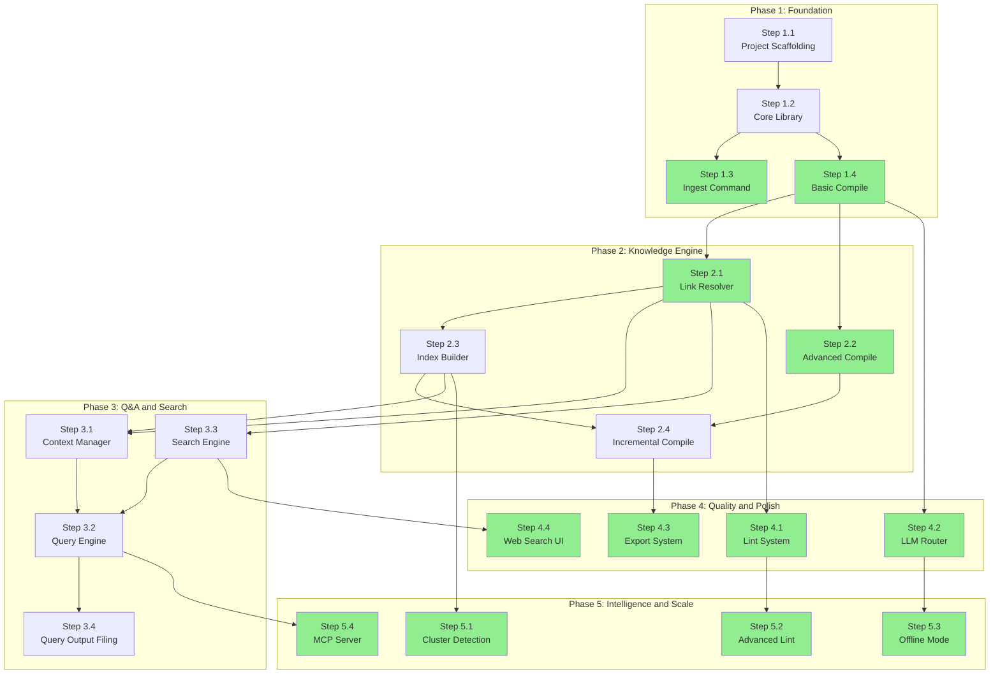

task_id: ses_2941babaaffenqkBv9x4h7PZFi (for resuming to continue this task if needed)

<task_result>
I've absorbed the complete architecture. Now I'll write the full implementation blueprint. This is a large, detailed document — the master plan that all implementation agents will follow.

---

# OAR Implementation Blueprint

**Document**: `/Users/brian/oar/plans/IMPLEMENTATION-BLUEPRINT.md`  
**Architecture Reference**: `/Users/brian/oar/ARCHITECTURE.md`  
**Created**: 2025-04-08  
**Status**: Ready for Execution  
**Total Steps**: 20 across 5 phases  
**Parallelizable Groups**: 6  

---

## Dependency Graph



### Parallelization Summary

| Parallel Group | Steps | Rationale |
|---|---|---|
| **PG-1** (after 1.2) | 1.3 + 1.4 | Ingest and Compile are independent |
| **PG-2** (after 1.4) | 2.1 + 2.2 | Link Resolver and Advanced Compile share no files |
| **PG-3** (all Phase 4) | 4.1 + 4.2 + 4.3 + 4.4 | All Phase 4 steps are independent |
| **PG-4** (all Phase 5) | 5.1 + 5.2 + 5.3 + 5.4 | All Phase 5 steps are independent |

---

## Anti-Patterns Catalog

| # | Anti-Pattern | Why It's Dangerous | What To Do Instead |
|---|---|---|---|
| AP-1 | Skipping tests to "save time" | Unverified code becomes technical debt immediately | Write tests BEFORE implementation in every step |
| AP-2 | Building all CLI commands at once | Monolithic PRs are unreviewable, unrevertable | One command per step, verified independently |
| AP-3 | Using a database for state | Violates ADR-1, breaks Obsidian compatibility | Files + JSON only; SQLite only for FTS5 search |
| AP-4 | Implementing vector search early | Unnecessary complexity at <5K articles | Use compiled wiki navigation (Phase 2 index system) |
| AP-5 | Making LLM calls without cost tracking | Costs spiral silently | Implement CostTracker in Step 1.4, use in ALL LLM steps |
| AP-6 | Hardcoding model names | Ties to single provider, prevents offline fallback | Use litellm model aliases via LLM Router (Step 4.2) |
| AP-7 | Creating Obsidian plugin | Out of scope, blocks CLI progress | CLI is primary; plugin deferred to future phase |
| AP-8 | Monolithic test files | Hard to maintain, slow test runs | One test file per module; shared fixtures in conftest.py |
| AP-9 | Mutable global state | Hidden coupling between components | Explicit dependency injection, pure functions where possible |
| AP-10 | Premature optimization | Complicates code before scale data exists | Optimize only when metrics prove a bottleneck |

---

## Shared Test Infrastructure

The following test fixtures are established in Step 1.1 and reused across ALL subsequent steps. Every step references these.

### Standard Test Fixtures (`tests/conftest.py`)

| Fixture | Purpose | Returns |
|---|---|---|
| `tmp_vault` | Creates a complete empty vault structure in a temp directory | `pathlib.Path` pointing to vault root |
| `sample_raw_article` | Writes a valid raw article to `01-raw/articles/` | `pathlib.Path` to the article file |
| `sample_compiled_article` | Writes a valid compiled article to `02-compiled/concepts/` | `pathlib.Path` to the article file |
| `sample_state` | Creates a `.oar/state.json` with test data | `dict` of the state data |
| `mock_llm_response` | Provides a mock LLM response object for testing without API calls | `unittest.mock.MagicMock` |

### Standard Verification Command

Every step ends with:
```bash
pytest tests/ -x --tb=short -q
```
If this command exits 0, the step passes. Additional per-step verification commands are listed in each step's Exit Criteria.

---

## Phase 1: Foundation (Week 1)

> **Goal**: A working CLI that can ingest documents and compile a single article via LLM. No wiki features yet — just the mechanical pipeline.

---

### Step 1.1: Project Scaffolding and Vault Initialization

**Step ID**: `S1.1`  
**Branch**: `feat/s11-project-scaffolding`

#### Context Brief

OAR is a Python CLI tool packaged as `oar`. The project needs a standard Python package structure with `pyproject.toml` for dependency management, a Typer-based CLI entry point, and a vault initialization system that creates the Obsidian-compatible directory tree described in ARCHITECTURE.md §3. The vault is a directory on disk — no database, no server. The `oar init` command creates this directory tree with all required subdirectories, a `.oar/config.yaml` with defaults, a `.oar/state.json` manifest, and index files (`_index.md`) in each section. This is the first code written — it establishes the package layout, test infrastructure, and the first CLI command that all subsequent steps depend on.

#### Architecture Reference

- ARCHITECTURE.md §3 — Directory/Vault Structure (complete tree)
- ARCHITECTURE.md §11 — Technology Stack (Python 3.11+, Typer, Rich, Pydantic)
- ARCHITECTURE.md §13 — Project Structure (Python package layout)
- ARCHITECTURE.md §4.3 — State Manifest format (`.oar/state.json`)

#### Task List

**Create these files (in order):**

| # | File Path | Purpose |
|---|---|---|
| 1 | `pyproject.toml` | Package config: dependencies, entry points, pytest config |
| 2 | `oar/__init__.py` | Package init with `__version__ = "0.1.0"` |
| 3 | `oar/cli/__init__.py` | CLI package init |
| 4 | `oar/cli/main.py` | Typer app with `init` and `status` commands |
| 5 | `oar/core/__init__.py` | Core package init |
| 6 | `oar/core/vault.py` | `Vault` class — init, validate, resolve paths |
| 7 | `oar/core/config.py` | Pydantic `OarConfig` model, load/save config.yaml |
| 8 | `oar/core/state.py` | `StateManager` class — init/load/save state.json |
| 9 | `scripts/setup-vault.sh` | Optional shell script for manual vault setup |
| 10 | `tests/conftest.py` | Shared pytest fixtures (tmp_vault, sample articles, etc.) |
| 11 | `tests/test_s11_scaffolding.py` | Tests for this step |
| 12 | `tests/test_core_vault.py` | Tests for vault module |
| 13 | `tests/test_core_config.py` | Tests for config module |
| 14 | `tests/test_core_state.py` | Tests for state module |

**`pyproject.toml` specifications:**
- Python >=3.11
- Dependencies: `typer[all]>=0.9`, `rich>=13`, `pydantic>=2.0`, `python-frontmatter>=1.0`, `pyyaml>=6.0`, `jinja2>=3.1`, `litellm>=1.0`
- Dev dependencies: `pytest>=7.0`, `pytest-tmp-files>=0.0.2` (or manual tmp_path usage), `pytest-mock>=3.0`
- Entry point: `[project.scripts] oar = "oar.cli.main:app"`
- pytest config: `testpaths = ["tests"]`, `python_files = ["test_*.py"]`

**`oar/core/vault.py` — Vault class API:**
```python
class Vault:
    def __init__(self, path: Path): ...
    def init(self) -> None: ...              # Create full directory tree
    def validate(self) -> bool: ...           # Check tree is intact
    def resolve(self, rel_path: str) -> Path: ...  # Resolve vault-relative path
    @property
    def raw_dir(self) -> Path: ...           # → vault/01-raw/
    @property
    def compiled_dir(self) -> Path: ...      # → vault/02-compiled/
    @property
    def indices_dir(self) -> Path: ...       # → vault/03-indices/
    @property
    def oar_dir(self) -> Path: ...           # → vault/.oar/
```

**`oar/core/config.py` — OarConfig model:**
```python
class OarConfig(BaseModel):
    vault_path: str = ""
    llm: LlmConfig = LlmConfig()             # default_model, max_cost_per_call, etc.
    compile: CompileConfig = CompileConfig()  # default_type, auto_index, etc.
    
class LlmConfig(BaseModel):
    default_model: str = "claude-sonnet-4-20250514"
    fallback_model: str = "ollama/llama3.1"
    max_cost_per_call: float = 0.50
    
class CompileConfig(BaseModel):
    default_type: str = "concept"
    auto_index: bool = True
```

**`oar/core/state.py` — StateManager API:**
```python
class StateManager:
    def __init__(self, vault: Vault): ...
    def load(self) -> dict: ...
    def save(self, state: dict) -> None: ...
    def register_article(self, article_id: str, path: str, content_hash: str) -> None: ...
    def mark_compiled(self, article_id: str, compiled_ids: list[str]) -> None: ...
    def get_uncompiled(self) -> list[str]: ...
```

**`oar/cli/main.py` — CLI commands:**
- `oar init [--path PATH]` — Initialize a new vault at PATH (default: `./oar-vault`)
- `oar status` — Print vault stats from state.json

**Directory tree that `Vault.init()` creates:**
```
oar-vault/
├── README.md (auto-generated)
├── .oar/
│   ├── config.yaml
│   ├── state.json
│   ├── search-index/
│   ├── templates/
│   ├── prompts/
│   └── cache/
│       ├── prompt-cache/
│       └── response-cache/
├── 00-inbox/_index.md
├── 01-raw/{articles,papers,repos,images}/_index.md
├── 02-compiled/{concepts,entities,methods,comparisons,tutorials,timelines}/_index.md
├── 03-indices/{moc,tags,clusters}/ + orphans.md, stubs.md, recent.md, stats.md
├── 04-outputs/{answers,reports,slides,images}/_index.md
├── 05-logs/{lint-reports}/ + compile-log.md, query-log.md
```

#### Testing Requirements

**Tests to write FIRST (TDD — write before implementation):**

1. **`tests/test_s11_scaffolding.py`**:
   - `test_pyproject_exists` — Verify `pyproject.toml` exists and parses
   - `test_package_importable` — `import oar` succeeds
   - `test_cli_entry_point` — `oar --help` exits 0

2. **`tests/test_core_vault.py`**:
   - `test_vault_init_creates_directory_tree` — After `Vault(tmp).init()`, all 30+ directories exist
   - `test_vault_init_creates_state_json` — `.oar/state.json` exists and is valid JSON
   - `test_vault_init_creates_config_yaml` — `.oar/config.yaml` exists and parses
   - `test_vault_init_creates_readme` — `README.md` exists at vault root
   - `test_vault_validate_on_valid_vault` — Returns True on initialized vault
   - `test_vault_validate_on_invalid_vault` — Returns False on empty directory
   - `test_vault_resolve_path` — `vault.resolve("01-raw/articles/test.md")` returns correct absolute path
   - `test_vault_properties` — `raw_dir`, `compiled_dir`, `indices_dir`, `oar_dir` return correct paths
   - `test_vault_init_idempotent` — Running init twice doesn't error or corrupt

3. **`tests/test_core_config.py`**:
   - `test_config_default_values` — New config has expected defaults
   - `test_config_save_and_load` — Round-trip through YAML file
   - `test_config_load_missing_file` — Returns defaults without error

4. **`tests/test_core_state.py`**:
   - `test_state_init_creates_empty_state` — New state has version, empty articles dict
   - `test_state_register_article` — Adds article to state with hash
   - `test_state_mark_compiled` — Sets compiled=True and compiled_into list
   - `test_state_get_uncompiled` — Returns only articles with compiled=False
   - `test_state_persists_to_disk` — Save and reload produces same data

**Test runner command:**
```bash
pytest tests/test_s11_scaffolding.py tests/test_core_vault.py tests/test_core_config.py tests/test_core_state.py -v
```

#### Exit Criteria

- [ ] `pytest tests/ -x --tb=short` exits 0
- [ ] `oar init --path /tmp/test-vault` creates complete directory tree
- [ ] `oar status` (inside initialized vault) prints vault stats without error
- [ ] All 4 test files pass with 100% of tests green
- [ ] `python -c "import oar; print(oar.__version__)"` prints `0.1.0`
- [ ] `oar --help` shows `init` and `status` commands

#### Dependencies

None. This is the first step.

#### Estimated Complexity

| Metric | Value |
|---|---|
| Files to create | 14 |
| Lines of code (estimate) | 600-800 |
| Lines of test code | 300-400 |
| Model tier | Default (Sonnet) |
| Estimated time | 2-3 hours |

#### Rollback Strategy

Delete all created files. No prior state to corrupt — this is the first step. If `pyproject.toml` has wrong dependencies, fix it before proceeding to Step 1.2.

---

### Step 1.2: Core Library — Frontmatter, Vault Operations, Content Hashing

**Step ID**: `S1.2`  
**Branch**: `feat/s12-core-library`

#### Context Brief

OAR stores all metadata as YAML frontmatter in markdown files (ARCHITECTURE.md §4). This step builds the core library for reading/writing frontmatter on `.md` files, computing SHA-256 content hashes for change detection (used by the incremental compile engine in Step 2.4), and a `VaultOps` utility class for common file operations within the vault (list articles, read article, write article, move article). These are the foundational building blocks that every subsequent step depends on — ingest, compile, lint, search, and export all use these primitives. The frontmatter schema for both raw and compiled articles is defined in ARCHITECTURE.md §4.1 and §4.2.

#### Architecture Reference

- ARCHITECTURE.md §4.1 — Compiled Article Format (full frontmatter schema)
- ARCHITECTURE.md §4.2 — Raw Article Format (frontmatter schema)
- ARCHITECTURE.md §5 — System Components (Frontmatter Parser, Diff Engine)

#### Task List

| # | File Path | Purpose |
|---|---|---|
| 1 | `oar/core/frontmatter.py` | `FrontmatterManager` — read/write/validate YAML frontmatter |
| 2 | `oar/core/hashing.py` | `content_hash(path) -> str` — SHA-256 of file content |
| 3 | `oar/core/vault_ops.py` | `VaultOps` — high-level file operations within vault |
| 4 | `oar/core/slug.py` | `slugify(text) -> str` — URL-safe slug generation |
| 5 | `oar/core/models.py` | Pydantic models for `RawArticleMeta`, `CompiledArticleMeta` |
| 6 | `tests/test_core_frontmatter.py` | Tests for frontmatter module |
| 7 | `tests/test_core_hashing.py` | Tests for content hashing |
| 8 | `tests/test_core_vault_ops.py` | Tests for vault operations |
| 9 | `tests/test_core_slug.py` | Tests for slug generation |
| 10 | `tests/test_core_models.py` | Tests for Pydantic models |

**`oar/core/frontmatter.py` — API:**
```python
class FrontmatterManager:
    """Read and write YAML frontmatter on markdown files."""
    
    def read(self, path: Path) -> tuple[dict, str]:
        """Returns (frontmatter_dict, body_text)."""
        
    def write(self, path: Path, metadata: dict, body: str) -> None:
        """Write metadata as YAML frontmatter + body to file."""
        
    def update_metadata(self, path: Path, updates: dict) -> None:
        """Merge updates into existing frontmatter, preserving body."""
        
    def validate_raw(self, metadata: dict) -> list[str]:
        """Validate raw article frontmatter. Returns list of errors."""
        
    def validate_compiled(self, metadata: dict) -> list[str]:
        """Validate compiled article frontmatter. Returns list of errors."""
```

**`oar/core/hashing.py`:**
```python
def content_hash(path: Path) -> str:
    """SHA-256 hash of file content. Returns 'sha256:abcdef...'."""

def content_hash_string(content: str) -> str:
    """SHA-256 hash of a string. Returns 'sha256:abcdef...'."""

def has_content_changed(path: Path, previous_hash: str) -> bool:
    """Compare current file hash to stored hash."""
```

**`oar/core/vault_ops.py` — API:**
```python
class VaultOps:
    def __init__(self, vault: Vault): ...
    
    def list_raw_articles(self) -> list[Path]: ...
    def list_compiled_articles(self) -> list[Path]: ...
    def read_article(self, path: Path) -> tuple[dict, str]: ...
    def write_raw_article(self, filename: str, metadata: dict, body: str) -> Path: ...
    def write_compiled_article(self, subdir: str, filename: str, metadata: dict, body: str) -> Path: ...
    def get_article_by_id(self, article_id: str) -> Path | None: ...
    def compute_word_count(self, body: str) -> int: ...
    def compute_read_time(self, word_count: int) -> int: ...  # words / 200
```

**`oar/core/models.py` — Pydantic models:**
```python
class RawArticleMeta(BaseModel):
    id: str
    title: str
    source_url: str = ""
    source_type: str = "file"           # article | paper | repo | file | url
    author: str = ""
    published: str = ""
    clipped: str = ""                    # ISO 8601 datetime
    compiled: bool = False
    compiled_into: list[str] = []
    word_count: int = 0
    language: str = "en"

class CompiledArticleMeta(BaseModel):
    id: str
    title: str
    aliases: list[str] = []
    created: str = ""
    updated: str = ""
    version: int = 1
    type: str = "concept"               # concept|entity|method|comparison|tutorial|timeline
    domain: list[str] = []
    tags: list[str] = []
    status: str = "draft"               # stub|draft|mature|review
    confidence: float = 0.0
    sources: list[str] = []
    source_count: int = 0
    related: list[str] = []
    prerequisite_for: list[str] = []
    see_also: list[str] = []
    word_count: int = 0
    read_time_min: int = 0
    backlink_count: int = 0
    complexity: str = "intermediate"     # beginner|intermediate|advanced
```

**`oar/core/slug.py`:**
```python
def slugify(text: str) -> str:
    """Convert text to URL-safe slug: lowercase, hyphens, no special chars."""
```

#### Testing Requirements

**Tests to write FIRST:**

1. **`tests/test_core_frontmatter.py`**:
   - `test_read_frontmatter_from_valid_file` — Returns correct dict and body
   - `test_read_frontmatter_from_no_frontmatter_file` — Returns empty dict and full body
   - `test_write_frontmatter_creates_valid_yaml` — Written file parses correctly
   - `test_update_metadata_preserves_body` — Body unchanged after metadata update
   - `test_update_metadata_merges_dicts` — New keys added, existing keys overwritten
   - `test_validate_raw_valid` — No errors on valid raw article metadata
   - `test_validate_raw_missing_id` — Returns error about missing id
   - `test_validate_compiled_valid` — No errors on valid compiled metadata
   - `test_validate_compiled_missing_required_fields` — Returns errors for missing type, status

2. **`tests/test_core_hashing.py`**:
   - `test_content_hash_deterministic` — Same file → same hash
   - `test_content_hash_different_for_different_content` — Changed file → different hash
   - `test_content_hash_format` — Returns `sha256:` prefix + 64 hex chars
   - `test_has_content_changed_true` — Modified file returns True
   - `test_has_content_changed_false` — Unmodified file returns False

3. **`tests/test_core_vault_ops.py`**:
   - `test_list_raw_articles_empty` — Returns [] for empty vault
   - `test_list_raw_articles_finds_files` — Returns paths to .md files in 01-raw/
   - `test_write_raw_article_creates_file` — File exists with correct frontmatter
   - `test_write_compiled_article_creates_in_subdir` — File in correct subdirectory
   - `test_read_article_roundtrip` — Write then read produces same data
   - `test_compute_word_count` — "hello world foo" → 3
   - `test_compute_read_time` — 400 words → 2 minutes

4. **`tests/test_core_slug.py`**:
   - `test_slugify_basic` — `"Hello World"` → `"hello-world"`
   - `test_slugify_special_chars` — `"C++ & Python!"` → `"c-python"`
   - `test_slugify_already_slug` — Idempotent

5. **`tests/test_core_models.py`**:
   - `test_raw_article_meta_defaults` — Default values are correct
   - `test_raw_article_meta_from_dict` — Parses dict correctly
   - `test_compiled_article_meta_defaults` — Default values are correct
   - `test_compiled_article_meta_serialization` — Round-trip through dict

**Test runner command:**
```bash
pytest tests/test_core_frontmatter.py tests/test_core_hashing.py tests/test_core_vault_ops.py tests/test_core_slug.py tests/test_core_models.py -v
```

#### Exit Criteria

- [ ] `pytest tests/ -x --tb=short` exits 0
- [ ] `FrontmatterManager` can read and write YAML frontmatter on any `.md` file
- [ ] `content_hash()` returns consistent `sha256:` prefixed hashes
- [ ] `VaultOps` can list, read, write articles in the vault
- [ ] Pydantic models validate raw and compiled article schemas
- [ ] `slugify()` produces clean kebab-case slugs
- [ ] No regression in Step 1.1 tests

#### Dependencies

- **Step 1.1** must be complete (package structure, Vault class, StateManager)

#### Estimated Complexity

| Metric | Value |
|---|---|
| Files to create | 10 |
| Lines of code (estimate) | 500-700 |
| Lines of test code | 400-500 |
| Model tier | Default (Sonnet) |
| Estimated time | 2-3 hours |

#### Rollback Strategy

Delete the 5 new source files and 5 test files. Steps 1.1 remains unaffected since these are new modules, not modifications. If `python-frontmatter` library has compatibility issues, switch to manual YAML parsing with PyYAML (already a dependency).

---

### Step 1.3: Ingest Command — URL Fetch, File Copy, Frontmatter Generation

**Step ID**: `S1.3`  
**Branch**: `feat/s13-ingest-command`

#### Context Brief

The `oar ingest` command is the entry point for all content entering the vault (ARCHITECTURE.md §6, "Ingestion" data flow). It accepts URLs (fetches via httpx/requests), local files (copies), and directories (batch import). For each source, it generates a properly formatted raw article in `01-raw/articles/` (or appropriate subdirectory) with complete YAML frontmatter (ARCHITECTURE.md §4.2), registers the article in `.oar/state.json` with a content hash, and sets `compiled: false`. URL fetching extracts the page title and readable content using a readability library. The ingest command does NOT call an LLM — it's a mechanical pipeline that normalizes content into the vault's raw format.

#### Architecture Reference

- ARCHITECTURE.md §4.2 — Raw Article Format (frontmatter schema)
- ARCHITECTURE.md §6 — Data Flow: Ingestion
- ARCHITECTURE.md §10 — CLI Reference: `oar ingest`

#### Task List

| # | File Path | Purpose |
|---|---|---|
| 1 | `oar/cli/ingest.py` | `ingest` Typer command with `--url`, `--file`, `--dir`, `--type` options |
| 2 | `oar/ingest/__init__.py` | Ingest package init |
| 3 | `oar/ingest/fetcher.py` | `URLFetcher` — fetch URL, extract title/content, handle errors |
| 4 | `oar/ingest/file_importer.py` | `FileImporter` — copy/convert local files, detect type |
| 5 | `oar/ingest/metadata.py` | `generate_raw_metadata()` — build frontmatter dict from source info |
| 6 | `tests/test_cli_ingest.py` | Tests for ingest CLI command |
| 7 | `tests/test_ingest_fetcher.py` | Tests for URL fetcher (mocked HTTP) |
| 8 | `tests/test_ingest_file_importer.py` | Tests for file importer |
| 9 | `tests/test_ingest_metadata.py` | Tests for metadata generation |

**`oar/cli/ingest.py` — CLI command:**
```python
@app.command()
def ingest(
    url: str | None = typer.Option(None, "--url", help="URL to fetch"),
    file: Path | None = typer.Option(None, "--file", help="Local file to import"),
    dir: Path | None = typer.Option(None, "--dir", help="Directory to batch import"),
    type: str = typer.Option("article", "--type", help="article|paper|repo"),
):
    """Import documents into the vault's raw directory."""
```

**`oar/ingest/fetcher.py` — API:**
```python
class URLFetcher:
    def __init__(self, timeout: int = 30): ...
    def fetch(self, url: str) -> FetchResult: ...
    
@dataclass
class FetchResult:
    title: str
    content: str          # Markdown-converted HTML content
    url: str
    author: str = ""
    published_date: str = ""
    word_count: int = 0
    language: str = "en"
```

**`oar/ingest/file_importer.py` — API:**
```python
class FileImporter:
    def import_file(self, source: Path, dest_dir: Path, source_type: str = "file") -> Path: ...
    def import_directory(self, source_dir: Path, dest_dir: Path) -> list[Path]: ...
    def detect_type(self, path: Path) -> str: ...  # article|paper|repo based on ext/content
```

**`oar/ingest/metadata.py`:**
```python
def generate_raw_metadata(
    title: str,
    source_url: str = "",
    source_type: str = "file",
    author: str = "",
    published: str = "",
    content: str = "",
) -> dict:
    """Generate a complete raw article frontmatter dict per ARCHITECTURE.md §4.2."""
```

**Additional dependency to add to `pyproject.toml`:**
- `httpx>=0.25` (for URL fetching)
- `readability-lxml>=0.7` or `trafilatura>=1.6` (for content extraction)
- `beautifulsoup4>=4.12` (for HTML cleanup)

#### Testing Requirements

**Tests to write FIRST:**

1. **`tests/test_ingest_fetcher.py`** (all HTTP calls mocked):
   - `test_fetch_url_extracts_title` — Mock response → correct title extracted
   - `test_fetch_url_extracts_content` — Mock HTML → markdown content
   - `test_fetch_url_handles_timeout` — Raises appropriate error
   - `test_fetch_url_handles_404` — Raises `IngestError` with useful message
   - `test_fetch_url_computes_word_count` — Correct count from extracted content

2. **`tests/test_ingest_file_importer.py`**:
   - `test_import_file_copies_to_raw` — File appears in `01-raw/articles/`
   - `test_import_file_preserves_content` — Content unchanged after import
   - `test_import_file_detects_type_md` — `.md` → "article"
   - `test_import_file_detects_type_pdf` — `.pdf` → "paper"
   - `test_import_directory_imports_all_md` — All `.md` files imported
   - `test_import_directory_skips_hidden_files` — `.DS_Store` ignored

3. **`tests/test_ingest_metadata.py`**:
   - `test_generate_raw_metadata_has_required_fields` — All §4.2 fields present
   - `test_generate_raw_metadata_generates_id` — ID format: `{YYYY-MM-DD}-{slug}`
   - `test_generate_raw_metadata_compiled_false` — `compiled` field is False
   - `test_generate_raw_metadata_computes_word_count` — Correct count

4. **`tests/test_cli_ingest.py`** (integration tests with tmp_vault):
   - `test_ingest_url_creates_raw_article` — End-to-end: mock URL → file in vault
   - `test_ingest_file_creates_raw_article` — End-to-end: local file → vault
   - `test_ingest_updates_state` — State shows new article with hash
   - `test_ingest_prints_confirmation` — Rich output shows article title and path
   - `test_ingest_no_source_errors` — No `--url` or `--file` → error message

**Test runner command:**
```bash
pytest tests/test_ingest*.py tests/test_cli_ingest.py -v
```

#### Exit Criteria

- [ ] `pytest tests/ -x --tb=short` exits 0 (all steps' tests pass)
- [ ] `oar ingest --url https://example.com/article` creates a raw article in vault (with mocked HTTP)
- [ ] `oar ingest --file ./notes.md` copies file to `01-raw/articles/`
- [ ] Ingested articles have valid frontmatter per ARCHITECTURE.md §4.2
- [ ] `.oar/state.json` updated with article ID, path, and content hash
- [ ] `oar status` shows incremented raw article count

#### Dependencies

- **Step 1.1** (Vault, StateManager, CLI framework)
- **Step 1.2** (FrontmatterManager, VaultOps, slugify, content_hash, models)

#### Estimated Complexity

| Metric | Value |
|---|---|
| Files to create | 9 |
| Lines of code (estimate) | 500-650 |
| Lines of test code | 350-450 |
| Model tier | Default (Sonnet) |
| Estimated time | 2-3 hours |

#### Rollback Strategy

Revert the ingest CLI command registration in `oar/cli/main.py`, delete `oar/ingest/` package and test files. Steps 1.1 and 1.2 are unaffected since ingest is a new module that only consumes their APIs.

---

### Step 1.4: Basic Compile — Single Article Compilation Using LLM

**Step ID**: `S1.4`  
**Branch**: `feat/s14-basic-compile`

#### Context Brief

The `oar compile` command reads raw articles from `01-raw/` and uses an LLM to produce compiled wiki articles in `02-compiled/` (ARCHITECTURE.md §6, "Compilation" data flow). This step implements single-article compilation only: one raw article → one compiled article. The compiler sends the raw article's body text to the LLM with a prompt that instructs it to produce a compiled article following the template in ARCHITECTURE.md §4.1, including TL;DR, Overview, Key Ideas, How It Works, References, and proper `[[wikilinks]]`. It also generates complete frontmatter (type, domain, tags, related, confidence, complexity). This step introduces the LLM Router (basic version — just `litellm.completion` wrapped with cost tracking) and the Jinja2 template system for the compiled article format. The CostTracker is critical — it must track input tokens, output tokens, model used, and estimated cost for EVERY LLM call.

#### Architecture Reference

- ARCHITECTURE.md §4.1 — Compiled Article Format (full schema + template)
- ARCHITECTURE.md §6 — Data Flow: Compilation
- ARCHITECTURE.md §9 — LLM Integration Strategy (model tiering, cost optimization)
- ARCHITECTURE.md §10 — CLI Reference: `oar compile`

#### Task List

| # | File Path | Purpose |
|---|---|---|
| 1 | `oar/llm/__init__.py` | LLM package init |
| 2 | `oar/llm/router.py` | `LLMRouter` — model selection, litellm wrapper, cost tracking |
| 3 | `oar/llm/cost_tracker.py` | `CostTracker` — per-call and cumulative cost tracking |
| 4 | `oar/llm/prompts.py` | Prompt loader — read prompt templates from `.oar/prompts/` |
| 5 | `oar/compile/__init__.py` | Compile package init |
| 6 | `oar/compile/compiler.py` | `Compiler` — orchestrate single-article compilation |
| 7 | `oar/compile/classifier.py` | `classify_article()` — determine type/domain/tags (LLM-based) |
| 8 | `oar/cli/compile.py` | `compile` Typer command with `--article`, `--all`, `--model` options |
| 9 | `oar/templates/compiled-article.md.j2` | Jinja2 template for compiled article body |
| 10 | `.oar/prompts/compile-article.md` (in vault init) | Default prompt template for compilation |
| 11 | `tests/test_llm_router.py` | Tests for LLM router (mocked litellm) |
| 12 | `tests/test_llm_cost_tracker.py` | Tests for cost tracker |
| 13 | `tests/test_compile_compiler.py` | Tests for compiler (mocked LLM) |
| 14 | `tests/test_compile_classifier.py` | Tests for classifier (mocked LLM) |
| 15 | `tests/test_cli_compile.py` | Integration tests for compile CLI |

**`oar/llm/router.py` — API:**
```python
class LLMRouter:
    def __init__(self, config: LlmConfig, cost_tracker: CostTracker): ...
    
    def complete(
        self,
        messages: list[dict],
        model: str | None = None,        # None = use default
        max_tokens: int = 4096,
        temperature: float = 0.3,
        task: str = "compile",            # For model tier selection
    ) -> LLMResponse: ...

@dataclass
class LLMResponse:
    content: str
    model: str
    input_tokens: int
    output_tokens: int
    cost_usd: float
    cached: bool = False
```

**`oar/llm/cost_tracker.py` — API:**
```python
class CostTracker:
    def __init__(self, state_dir: Path): ...
    
    def record(self, model: str, input_tokens: int, output_tokens: int, cost_usd: float, task: str) -> None: ...
    def get_session_cost(self) -> float: ...
    def get_total_cost(self) -> float: ...
    def get_call_history(self) -> list[dict]: ...
    def check_budget(self, max_cost: float) -> bool: ...
```

**`oar/compile/compiler.py` — API:**
```python
class Compiler:
    def __init__(self, vault: Vault, router: LLMRouter, ops: VaultOps): ...
    
    def compile_article(self, raw_path: Path) -> CompileResult: ...
    def compile_single(self, article_id: str) -> CompileResult: ...
    def compile_all(self, limit: int = 10, max_cost: float = 5.00) -> list[CompileResult]: ...

@dataclass
class CompileResult:
    raw_id: str
    compiled_id: str
    compiled_path: Path
    tokens_used: int
    cost_usd: float
    success: bool
    error: str = ""
```

**`oar/cli/compile.py` — CLI command:**
```python
@app.command()
def compile(
    article: str | None = typer.Option(None, "--article", help="Specific raw article ID"),
    all: bool = typer.Option(False, "--all", help="Compile all uncompiled articles"),
    model: str | None = typer.Option(None, "--model", help="Override default model"),
    max_cost: float = typer.Option(5.00, "--max-cost", help="Max spend this run"),
):
    """Compile raw articles into wiki articles using LLM."""
```

**Default prompt template (`.oar/prompts/compile-article.md`):**
```
You are compiling a raw document into a structured wiki article for a personal knowledge base.

## Input
The following is a raw document:

Title: {title}
Content:
{content}

## Instructions
1. Create a comprehensive wiki article that:
   - Starts with a TL;DR (1-2 sentences)
   - Has an Overview section (2-3 paragraphs)
   - Identifies Key Ideas as bullet points
   - Explains How It Works with clear steps
   - Links to related concepts using [[wikilinks]]
   - Includes a References section linking to source(s)

2. Extract metadata:
   - Article type: concept, entity, method, comparison, tutorial, or timeline
   - Domain tags (e.g., machine-learning, nlp, systems-design)
   - Related topics (as wikilink IDs)
   - Confidence level (0.0-1.0)
   - Complexity: beginner, intermediate, or advanced

3. Output format: Return a JSON object with keys:
   - "frontmatter": the metadata dict
   - "body": the markdown article body
```

#### Testing Requirements

**Tests to write FIRST:**

1. **`tests/test_llm_router.py`** (all litellm calls mocked):
   - `test_router_complete_returns_response` — Returns `LLMResponse` with content
   - `test_router_uses_default_model` — No model specified → uses config default
   - `test_router_overrides_model` — `model=` param → uses specified model
   - `test_router_records_cost` — CostTracker called with token counts
   - `test_router_handles_api_error` — Raises `LLMError` with useful message

2. **`tests/test_llm_cost_tracker.py`**:
   - `test_cost_tracker_records_call` — Call history has entry after record()
   - `test_cost_tracker_session_cost_sums` — Correct total for session
   - `test_cost_tracker_check_budget_under` — Returns True when under budget
   - `test_cost_tracker_check_budget_over` — Returns False when over budget
   - `test_cost_tracker_persists_to_disk` — Save/reload preserves history

3. **`tests/test_compile_compiler.py`** (LLM mocked to return valid JSON):
   - `test_compile_article_creates_compiled_file` — File exists in `02-compiled/`
   - `test_compile_article_has_valid_frontmatter` — All §4.1 required fields present
   - `test_compile_article_has_body_sections` — TL;DR, Overview, Key Ideas present
   - `test_compile_article_updates_state` — state.json: compiled=True, compiled_into set
   - `test_compile_article_records_cost` — CostTracker has entry
   - `test_compile_article_handles_llm_error` — Result has success=False, error message
   - `test_compile_single_by_id` — Looks up article by ID, compiles it

4. **`tests/test_compile_classifier.py`** (LLM mocked):
   - `test_classify_returns_type` — Returns valid type string
   - `test_classify_returns_tags` — Returns list of tag strings
   - `test_classify_returns_domain` — Returns list of domain strings

5. **`tests/test_cli_compile.py`** (integration, mocked LLM):
   - `test_compile_article_cli` — `oar compile --article ID` exits 0
   - `test_compile_all_cli` — `oar compile --all` processes multiple articles
   - `test_compile_respects_max_cost` — Stops when cost limit reached
   - `test_compile_no_uncompiled_errors` — No uncompiled articles → informative message

**Test runner command:**
```bash
pytest tests/test_llm*.py tests/test_compile*.py tests/test_cli_compile.py -v
```

#### Exit Criteria

- [ ] `pytest tests/ -x --tb=short` exits 0
- [ ] `oar compile --article <id>` produces a compiled article in `02-compiled/`
- [ ] Compiled article has valid frontmatter per ARCHITECTURE.md §4.1
- [ ] Compiled article body has TL;DR, Overview, Key Ideas sections
- [ ] `state.json` updated: `compiled=True`, `compiled_into` list set
- [ ] CostTracker records input/output tokens and estimated cost
- [ ] `oar compile --all` processes all uncompiled articles (with mocked LLM)
- [ ] `oar compile --max-cost 0.01` respects cost budget

#### Dependencies

- **Step 1.1** (Vault, StateManager, CLI)
- **Step 1.2** (FrontmatterManager, VaultOps, content_hash, models)

#### Estimated Complexity

| Metric | Value |
|---|---|
| Files to create | 15 |
| Lines of code (estimate) | 800-1000 |
| Lines of test code | 500-600 |
| Model tier | Default (Sonnet) — for LLMRouter design |
| Estimated time | 3-4 hours |

#### Rollback Strategy

Delete `oar/llm/`, `oar/compile/`, and associated test files. Revert CLI registration in `oar/cli/main.py`. Steps 1.1–1.3 are unaffected. If litellm has issues, the `LLMRouter` abstraction means we can swap to `anthropic` SDK directly without changing the `Compiler` class.

---

## Phase 2: Knowledge Engine (Week 2-3)

> **Goal**: Full wiki compilation pipeline with link resolution, multi-article compilation, index generation, and incremental updates. After this phase, OAR can maintain a living wiki.

---

### Step 2.1: Link Resolver — Backlink Graph, Wikilink Extraction, Orphan Detection

**Step ID**: `S2.1`  
**Branch**: `feat/s21-link-resolver`

#### Context Brief

OAR's wiki uses `[[wikilinks]]` for all inter-article references (ARCHITECTURE.md §4.1). This step builds the link resolver — a graph layer over the filesystem that can extract all `[[wikilinks]]` from markdown files, build a bidirectional backlink map, detect orphan articles (fewer than 2 backlinks), and validate that all links point to existing articles. The link resolver is used by: the compiler (to insert relevant links), the index builder (to identify connected components), the context manager (to traverse related articles for Q&A), and the lint system (to find broken links). It reads compiled articles from `02-compiled/`, parses their body text and frontmatter `related`/`sources`/`see_also` fields, and maintains an in-memory graph that can be serialized to `.oar/link-graph.json` for caching.

#### Architecture Reference

- ARCHITECTURE.md §5 — System Components: Link Resolver
- ARCHITECTURE.md §7 — Index/Summary System (backlink_count in metrics)
- ARCHITECTURE.md §4.1 — `related`, `prerequisite_for`, `see_also` frontmatter fields

#### Task List

| # | File Path | Purpose |
|---|---|---|
| 1 | `oar/core/link_resolver.py` | `LinkResolver` — wikilink extraction, backlink graph, orphan detection |
| 2 | `oar/core/link_graph.py` | `LinkGraph` data structure — nodes, edges, traversal methods |
| 3 | `tests/test_core_link_resolver.py` | Tests for link resolver |
| 4 | `tests/test_core_link_graph.py` | Tests for link graph data structure |

**`oar/core/link_graph.py` — API:**
```python
class LinkGraph:
    """Bidirectional graph of wiki article connections."""
    
    def __init__(self): ...
    def add_node(self, article_id: str) -> None: ...
    def add_edge(self, source: str, target: str, link_type: str = "wikilink") -> None: ...
    def get_backlinks(self, article_id: str) -> list[str]: ...
    def get_forward_links(self, article_id: str) -> list[str]: ...
    def get_orphans(self, min_backlinks: int = 2) -> list[str]: ...
    def get_connected_component(self, article_id: str, max_depth: int = 3) -> set[str]: ...
    def get_all_nodes(self) -> set[str]: ...
    def validate_links(self, existing_ids: set[str]) -> list[BrokenLink]: ...
    def serialize(self) -> dict: ...
    @classmethod
    def deserialize(cls, data: dict) -> "LinkGraph": ...

@dataclass
class BrokenLink:
    source_article: str
    target_id: str
    context: str          # Surrounding text of the broken link
```

**`oar/core/link_resolver.py` — API:**
```python
class LinkResolver:
    def __init__(self, vault: Vault, ops: VaultOps): ...
    
    def extract_wikilinks(self, text: str) -> list[str]: ...
    def build_graph(self) -> LinkGraph: ...             # Scan all compiled articles
    def update_graph(self, graph: LinkGraph, changed_articles: list[str]) -> LinkGraph: ...
    def get_backlink_count(self, article_id: str) -> int: ...
    def find_orphans(self) -> list[str]: ...
    def find_broken_links(self) -> list[BrokenLink]: ...
```

**Wikilink extraction regex:**
```python
# Matches [[link]] and [[link|display text]]
WIKILINK_PATTERN = re.compile(r'\[\[([^\]|]+)(?:\|[^\]]+)?\]\]')
```

#### Testing Requirements

**Tests to write FIRST:**

1. **`tests/test_core_link_graph.py`**:
   - `test_add_node` — Node appears in get_all_nodes()
   - `test_add_edge_creates_forward_link` — Forward link exists
   - `test_add_edge_creates_backlink` — Backlink exists
   - `test_get_backlinks_multiple` — Multiple articles linking to one target
   - `test_get_forward_links` — All `[[links]]` from one article
   - `test_get_orphans` — Articles with <2 backlinks returned
   - `test_get_connected_component_depth1` — Direct neighbors only
   - `test_get_connected_component_depth2` — Includes neighbors' neighbors
   - `test_validate_links_finds_broken` — Links to non-existent articles flagged
   - `test_validate_links_all_valid` — No broken links → empty list
   - `test_serialize_deserialize_roundtrip` — Graph survives serialization

2. **`tests/test_core_link_resolver.py`**:
   - `test_extract_wikilinks_basic` — `"See [[attention]] and [[transformer]]"` → `["attention", "transformer"]`
   - `test_extract_wikilinks_with_display` — `"[[transformer|Transformer Arch]]"` → `["transformer"]`
   - `test_extract_wikilinks_no_links` — Plain text → empty list
   - `test_extract_wikilinks_in_frontmatter_fields` — Frontmatter `related` field parsed
   - `test_build_graph_scans_all_compiled` — Graph has nodes for all compiled articles
   - `test_build_graph_has_correct_edges` — Wikilinks in body become graph edges
   - `test_find_orphans_empty_vault` — No articles → no orphans
   - `test_find_orphans_identifies_isolated` — Single unlinked article → orphan
   - `test_find_broken_links_detects_missing` — Link to non-existent article flagged
   - `test_update_graph_incremental` — Only changed articles re-scanned

**Test runner command:**
```bash
pytest tests/test_core_link_graph.py tests/test_core_link_resolver.py -v
```

#### Exit Criteria

- [ ] `pytest tests/ -x --tb=short` exits 0
- [ ] `LinkGraph` correctly models bidirectional article connections
- [ ] `LinkResolver.extract_wikilinks()` parses `[[link]]` and `[[link|text]]` formats
- [ ] `LinkResolver.build_graph()` scans all compiled articles and builds complete graph
- [ ] Orphan detection works (articles with <2 backlinks identified)
- [ ] Broken link detection works (links to non-existent articles flagged)
- [ ] No regression in Phase 1 tests

#### Dependencies

- **Step 1.2** (VaultOps, FrontmatterManager — to read articles)
- **Step 1.4** (compiled articles must exist to build link graph)

#### Estimated Complexity

| Metric | Value |
|---|---|
| Files to create | 4 |
| Lines of code (estimate) | 400-550 |
| Lines of test code | 350-450 |
| Model tier | Default (Sonnet) |
| Estimated time | 2-3 hours |

#### Rollback Strategy

Delete `oar/core/link_resolver.py`, `oar/core/link_graph.py`, and test files. No other step depends on these yet. If the regex pattern for wikilinks is too greedy or too strict, adjust before Phase 2 integration.

---

### Step 2.2: Advanced Compile — Multi-Article Compilation, Concept Extraction, Classification

**Step ID**: `S2.2`  
**Branch**: `feat/s22-advanced-compile`

#### Context Brief

Step 1.4 implemented single-article compilation (one raw → one compiled). This step upgrades the compiler to handle multi-article compilation: multiple raw articles on the same topic are merged into one comprehensive compiled article (e.g., 3 raw articles about transformers → one `transformer-architecture.md`). It also adds automatic concept extraction (the LLM identifies sub-concepts that should become their own articles, like extracting "attention-mechanism" from a transformer article) and improved classification where the LLM determines the article type, domain, tags, and complexity. The compiler now uses the link resolver (from Step 2.1) to check existing articles and create appropriate wikilinks in generated content. This step also introduces the `--cascade` flag: when a compiled article is updated, articles that reference it are flagged for re-compilation.

#### Architecture Reference

- ARCHITECTURE.md §4.1 — Compiled Article Format (related, sources, see_also fields)
- ARCHITECTURE.md §6 — Data Flow: Compilation (context building)
- ARCHITECTURE.md §9 — Model Tiering (Sonnet for compile, Haiku for classify)

#### Task List

| # | File Path | Purpose |
|---|---|---|
| 1 | `oar/compile/compiler.py` | **Modify** — add multi-article compile, concept extraction, cascade |
| 2 | `oar/compile/concept_extractor.py` | `ConceptExtractor` — identify sub-concepts from compiled text |
| 3 | `oar/compile/classifier.py` | **Modify** — enhanced classification with domain inference |
| 4 | `oar/compile/context_builder.py` | `CompileContextBuilder` — build LLM context from multiple raw articles |
| 5 | `.oar/prompts/compile-multi.md` | Prompt template for multi-article compilation |
| 6 | `.oar/prompts/classify-concept.md` | Prompt template for concept classification |
| 7 | `tests/test_compile_compiler.py` | **Modify** — add multi-article test cases |
| 8 | `tests/test_compile_concept_extractor.py` | Tests for concept extractor |
| 9 | `tests/test_compile_context_builder.py` | Tests for context builder |

**`oar/compile/context_builder.py` — API:**
```python
class CompileContextBuilder:
    def __init__(self, vault: Vault, ops: VaultOps, link_resolver: LinkResolver): ...
    
    def build_single_context(self, raw_article: Path) -> str: ...
    def build_multi_context(self, raw_articles: list[Path]) -> str: ...
    def find_related_raw_articles(self, article_id: str, max: int = 5) -> list[Path]: ...
    def build_existing_context(self, compiled_id: str) -> str | None: ...
```

**`oar/compile/concept_extractor.py` — API:**
```python
class ConceptExtractor:
    def __init__(self, router: LLMRouter): ...
    
    def extract_concepts(self, compiled_body: str, article_id: str) -> list[ConceptSuggestion]: ...

@dataclass
class ConceptSuggestion:
    title: str
    slug: str
    type: str               # concept|entity|method
    reason: str             # Why this should be a separate article
    priority: int           # 1=high, 3=low
```

**Modified `oar/compile/compiler.py` additions:**
```python
class Compiler:
    # ... existing methods ...
    
    def compile_multi(self, raw_ids: list[str]) -> CompileResult: ...
    def compile_with_concepts(self, raw_id: str) -> MultiCompileResult: ...
    def cascade_update(self, compiled_id: str) -> list[str]: ...  # Returns list of articles flagged for recompile
    
@dataclass
class MultiCompileResult:
    main_result: CompileResult
    concept_suggestions: list[ConceptSuggestion]
    related_updates: list[str]  # IDs of articles that should be re-compiled
```

#### Testing Requirements

**Tests to write FIRST:**

1. **`tests/test_compile_context_builder.py`**:
   - `test_build_single_context_includes_body` — Context contains raw article text
   - `test_build_multi_context_combines_articles` — Multiple articles concatenated with headers
   - `test_build_multi_context_respects_token_limit` — Truncates if combined content exceeds limit
   - `test_find_related_by_frontmatter` — Finds articles with overlapping tags
   - `test_build_existing_context_returns_none_for_new` — No existing compiled → None

2. **`tests/test_compile_concept_extractor.py`** (LLM mocked):
   - `test_extract_concepts_returns_suggestions` — Returns list of ConceptSuggestion
   - `test_extract_concepts_has_slugs` — Each suggestion has a slugified ID
   - `test_extract_concepts_prioritizes` — Suggestions have priority scores
   - `test_extract_concepts_excludes_existing` — Doesn't suggest articles that already exist

3. **`tests/test_compile_compiler.py`** (additions):
   - `test_compile_multi_merges_articles` — Two raw articles → one compiled article
   - `test_compile_multi_has_combined_sources` — Sources frontmatter lists both raw articles
   - `test_compile_with_concepts_suggests_new` — Returns concept suggestions
   - `test_cascade_update_flags_related` — Updating article A flags articles that link to A
   - `test_cascade_update_no_related` — No backlinks → empty list

**Test runner command:**
```bash
pytest tests/test_compile_compiler.py tests/test_compile_concept_extractor.py tests/test_compile_context_builder.py -v
```

#### Exit Criteria

- [ ] `pytest tests/ -x --tb=short` exits 0
- [ ] `oar compile --articles id1,id2` merges two raw articles into one compiled article
- [ ] Compiled article has combined sources in frontmatter
- [ ] Concept extraction identifies sub-topics that should become separate articles
- [ ] Cascade update identifies articles that should be re-compiled after a change
- [ ] Context builder respects token limits when combining multiple articles
- [ ] All Phase 1 tests still pass

#### Dependencies

- **Step 1.4** (basic compiler, LLM Router, CostTracker)
- **Step 2.1** (LinkResolver — for wikilink validation and cascade detection)

#### Estimated Complexity

| Metric | Value |
|---|---|
| Files to create | 6 (modify 2) |
| Lines of code (estimate) | 600-800 |
| Lines of test code | 400-500 |
| Model tier | Default (Sonnet) |
| Estimated time | 3-4 hours |

#### Rollback Strategy

Revert `oar/compile/compiler.py` to Step 1.4 version. Delete new files (concept_extractor, context_builder). The link resolver (Step 2.1) is unaffected.

---

### Step 2.3: Index Builder — MOC Generation, Tag Pages, Master Index

**Step ID**: `S2.3`  
**Branch**: `feat/s23-index-builder`

#### Context Brief

The index system is OAR's core innovation (ARCHITECTURE.md §7). Instead of vector search, the LLM navigates a compiled wiki using structured index files. This step builds the index generator that creates: (1) a `_master-index.md` (~3K tokens, always fits in context) listing all MOCs and top-level topics, (2) Maps of Content (MOCs) in `03-indices/moc/` that are topic gateway pages listing all articles in a domain, (3) tag aggregation pages in `03-indices/tags/`, and (4) utility pages: `orphans.md`, `stubs.md`, `recent.md`, `stats.md`. The index builder reads all compiled articles, uses their frontmatter to group by domain/tags, optionally uses the LLM to identify topic clusters for MOCs, and writes the index files. These files are auto-regenerated whenever the wiki changes.

#### Architecture Reference

- ARCHITECTURE.md §7 — Index/Summary System (complete description)
- ARCHITECTURE.md §3 — `03-indices/` directory structure
- ARCHITECTURE.md §10 — CLI Reference: `oar index`

#### Task List

| # | File Path | Purpose |
|---|---|---|
| 1 | `oar/index/__init__.py` | Index package init |
| 2 | `oar/index/master_index.py` | `MasterIndexBuilder` — generate `_master-index.md` |
| 3 | `oar/index/moc_builder.py` | `MocBuilder` — generate MOC pages per domain/topic |
| 4 | `oar/index/tag_builder.py` | `TagBuilder` — generate tag aggregation pages |
| 5 | `oar/index/stats_builder.py` | `StatsBuilder` — generate `stats.md`, `recent.md`, `orphans.md`, `stubs.md` |
| 6 | `oar/index/index_manager.py` | `IndexManager` — orchestrates full index rebuild |
| 7 | `oar/cli/index.py` | `index` Typer command with `--rebuild` option |
| 8 | `oar/templates/index-moc.md.j2` | Jinja2 template for MOC pages |
| 9 | `oar/templates/master-index.md.j2` | Jinja2 template for master index |
| 10 | `tests/test_index_master.py` | Tests for master index builder |
| 11 | `tests/test_index_moc.py` | Tests for MOC builder |
| 12 | `tests/test_index_tags.py` | Tests for tag builder |
| 13 | `tests/test_index_stats.py` | Tests for stats builder |
| 14 | `tests/test_index_manager.py` | Integration tests for full rebuild |
| 15 | `tests/test_cli_index.py` | CLI integration tests |

**`oar/index/master_index.py` — API:**
```python
class MasterIndexBuilder:
    def __init__(self, vault: Vault, ops: VaultOps): ...
    
    def build(self) -> str: ...           # Returns generated markdown
    def write(self) -> Path: ...          # Writes to 03-indices/_master-index.md
    
    # Master index format:
    # # OAR Wiki Index
    # ## Topics (MOCs)
    # - [[moc-llm-foundations]] — 12 articles
    # - [[moc-systems-design]] — 8 articles
    # ## Quick Stats
    # - Total articles: 89
    # - Orphans: 5 | Stubs: 12
    # ## Recent
    # - [[attention-mechanism]] (updated 2024-03-10)
```

**`oar/index/moc_builder.py` — API:**
```python
class MocBuilder:
    def __init__(self, vault: Vault, ops: VaultOps, link_resolver: LinkResolver, router: LLMRouter | None): ...
    
    def build_moc(self, topic: str, article_ids: list[str]) -> str: ...
    def build_all_mocs(self) -> dict[str, Path]: ...     # Returns {topic: path}
    def group_articles_by_domain(self) -> dict[str, list[str]]: ...
```

**`oar/index/tag_builder.py` — API:**
```python
class TagBuilder:
    def __init__(self, vault: Vault, ops: VaultOps): ...
    
    def build_tag_page(self, tag: str, article_ids: list[str]) -> str: ...
    def build_all_tag_pages(self) -> dict[str, Path]: ...
    def collect_all_tags(self) -> dict[str, list[str]]: ...  # {tag: [article_ids]}
```

**`oar/index/index_manager.py` — API:**
```python
class IndexManager:
    def __init__(self, vault: Vault, ops: VaultOps, link_resolver: LinkResolver, router: LLMRouter | None): ...
    
    def rebuild_all(self) -> None: ...          # Full rebuild of all indices
    def rebuild_mocs(self) -> None: ...
    def rebuild_tags(self) -> None: ...
    def rebuild_stats(self) -> None: ...
```

**`oar/cli/index.py` — CLI command:**
```python
@app.command()
def index(
    rebuild: bool = typer.Option(False, "--rebuild", help="Full index rebuild"),
    detect_clusters: bool = typer.Option(False, "--detect-clusters", help="Auto-detect concept clusters"),
):
    """Build and maintain wiki index files."""
```

#### Testing Requirements

**Tests to write FIRST:**

1. **`tests/test_index_master.py`**:
   - `test_master_index_has_all_mocs` — Lists all MOCs with article counts
   - `test_master_index_has_quick_stats` — Article count, orphan count
   - `test_master_index_has_recent` — Lists recent articles
   - `test_master_index_under_3k_tokens` — Generated content fits token budget
   - `test_master_index_empty_vault` — Handles empty vault gracefully

2. **`tests/test_index_moc.py`**:
   - `test_build_moc_has_topic_header` — MOC starts with `# MOC: {topic}`
   - `test_build_moc_lists_articles` — All domain articles listed with wikilinks
   - `test_build_moc_groups_by_type` — Sections for concepts, methods, etc.
   - `test_group_articles_by_domain` — Correct domain → article mapping
   - `test_build_all_mocs_creates_files` — Files exist in `03-indices/moc/`

3. **`tests/test_index_tags.py`**:
   - `test_collect_all_tags` — Returns all unique tags with article lists
   - `test_build_tag_page_has_tag_header` — Starts with `# Tag: {tag}`
   - `test_build_tag_page_lists_articles` — All tagged articles listed
   - `test_build_all_tag_pages_creates_files` — Files in `03-indices/tags/`

4. **`tests/test_index_stats.py`**:
   - `test_stats_builder_counts_articles` — Correct raw/compiled counts
   - `test_stats_builder_word_count` — Correct total word count
   - `test_stats_builder_identifies_orphans` — Lists articles with <2 backlinks
   - `test_stats_builder_identifies_stubs` — Lists articles with status=stub
   - `test_stats_builder_recent_articles` — Lists last 20 by updated date

5. **`tests/test_index_manager.py`**:
   - `test_rebuild_all_creates_all_indices` — All index files created
   - `test_rebuild_all_idempotent` — Running twice produces same output
   - `test_rebuild_after_article_added` — New article appears in indices

6. **`tests/test_cli_index.py`**:
   - `test_index_rebuild_cli` — `oar index --rebuild` exits 0
   - `test_index_rebuild_updates_files` — Files modified after rebuild

**Test runner command:**
```bash
pytest tests/test_index*.py tests/test_cli_index.py -v
```

#### Exit Criteria

- [ ] `pytest tests/ -x --tb=short` exits 0
- [ ] `oar index --rebuild` creates all index files in `03-indices/`
- [ ] `_master-index.md` lists all MOCs, has stats, fits ~3K token budget
- [ ] MOC pages exist for each domain with wikilinks to all domain articles
- [ ] Tag pages exist for each unique tag
- [ ] `orphans.md`, `stubs.md`, `recent.md`, `stats.md` all populated
- [ ] Index rebuild is idempotent (same output on repeated runs)

#### Dependencies

- **Step 1.2** (VaultOps, FrontmatterManager — to read all articles)
- **Step 1.4** (compiled articles exist)
- **Step 2.1** (LinkResolver — for backlink counts and orphan detection)

#### Estimated Complexity

| Metric | Value |
|---|---|
| Files to create | 15 |
| Lines of code (estimate) | 700-900 |
| Lines of test code | 500-600 |
| Model tier | Default (Sonnet) |
| Estimated time | 3-4 hours |

#### Rollback Strategy

Delete `oar/index/` package, `oar/cli/index.py`, templates, and all test files. Revert CLI registration in main.py. Steps 2.1 and 2.2 are unaffected. Index files in the vault are safe to delete — they're auto-generated.

---

### Step 2.4: Incremental Compilation — Diff-Based Updates, State Tracking, Cascade Updates

**Step ID**: `S2.4`  
**Branch**: `feat/s24-incremental-compile`

#### Context Brief

OAR must efficiently handle updates: when a raw article changes (new content hash), only affected compiled articles should be re-compiled, and indices should be incrementally rebuilt (ARCHITECTURE.md §5, Diff Engine). This step implements: (1) content hash comparison to detect changed raw articles, (2) smart re-compilation that only processes articles whose sources have changed, (3) cascade updates where re-compiling article A triggers re-compilation of articles that depend on A's content, and (4) incremental index updates (only rebuild MOCs for affected domains, only update affected tag pages). The state.json tracks content hashes for all raw articles, and the compiler uses these to detect what needs re-processing.

#### Architecture Reference

- ARCHITECTURE.md §5 — System Components: Diff Engine, State Manager
- ARCHITECTURE.md §4.3 — State Manifest format (content_hash, compiled, last_compiled)
- ARCHITECTURE.md §10 — `oar compile --cascade`

#### Task List

| # | File Path | Purpose |
|---|---|---|
| 1 | `oar/compile/incremental.py` | `IncrementalCompiler` — detect changes, plan re-compilation |
| 2 | `oar/compile/diff_engine.py` | `DiffEngine` — content hash comparison, change detection |
| 3 | `oar/core/state.py` | **Modify** — add change tracking methods |
| 4 | `oar/index/index_manager.py` | **Modify** — add incremental update methods |
| 5 | `oar/cli/compile.py` | **Modify** — add `--cascade`, `--dry-run` flags |
| 6 | `tests/test_compile_incremental.py` | Tests for incremental compiler |
| 7 | `tests/test_compile_diff_engine.py` | Tests for diff engine |

**`oar/compile/diff_engine.py` — API:**
```python
class DiffEngine:
    def __init__(self, state_manager: StateManager, ops: VaultOps): ...
    
    def detect_changed_raws(self) -> list[ChangedArticle]: ...
    def detect_changed_compiled(self) -> list[ChangedArticle]: ...
    def compute_compile_plan(self) -> CompilePlan: ...

@dataclass
class ChangedArticle:
    article_id: str
    path: Path
    old_hash: str | None
    new_hash: str

@dataclass
class CompilePlan:
    to_compile: list[str]          # Raw articles needing (re)compilation
    to_recompile: list[str]        # Compiled articles needing update
    to_index_rebuild: list[str]    # Domains/tags affected
    estimated_cost: float
```

**`oar/compile/incremental.py` — API:**
```python
class IncrementalCompiler:
    def __init__(self, compiler: Compiler, diff_engine: DiffEngine, index_manager: IndexManager): ...
    
    def run(self, max_cost: float = 5.00, dry_run: bool = False) -> IncrementalResult: ...
    def cascade_compile(self, article_id: str) -> list[CompileResult]: ...
    
@dataclass
class IncrementalResult:
    compiled: list[CompileResult]
    indices_rebuilt: list[str]
    total_cost: float
    skipped: int                     # Articles unchanged, skipped
```

#### Testing Requirements

**Tests to write FIRST:**

1. **`tests/test_compile_diff_engine.py`**:
   - `test_detect_changed_raws_none` — No changes → empty list
   - `test_detect_changed_raws_modified` — Modified file → detected
   - `test_detect_changed_raws_new` — New raw article → detected
   - `test_compute_compile_plan` — Correct plan with affected domains
   - `test_compute_compile_plan_estimates_cost` — Cost estimate present

2. **`tests/test_compile_incremental.py`**:
   - `test_run_no_changes` — No changes → nothing compiled, cost=0
   - `test_run_with_changes` — Changed articles → re-compiled
   - `test_run_respects_cost_limit` — Stops when cost budget exhausted
   - `test_run_dry_run` — Plans but doesn't execute
   - `test_cascade_compile_triggers_related` — Recompiling A triggers recompile of B (which links to A)
   - `test_cascade_compile_depth_limit` — Doesn't cascade infinitely
   - `test_incremental_updates_indices` — Affected MOCs/tags rebuilt

**Test runner command:**
```bash
pytest tests/test_compile_incremental.py tests/test_compile_diff_engine.py -v
```

#### Exit Criteria

- [ ] `pytest tests/ -x --tb=short` exits 0
- [ ] `DiffEngine.detect_changed_raws()` identifies modified raw articles
- [ ] `IncrementalCompiler.run()` only re-compiles changed articles
- [ ] `--dry-run` flag shows what would be compiled without executing
- [ ] Cascade compile correctly identifies and re-compiles dependent articles
- [ ] Affected indices are rebuilt after re-compilation
- [ ] Cost estimate is accurate for planned operations
- [ ] All Phase 1 and Phase 2 tests pass

#### Dependencies

- **Step 1.2** (content_hash, StateManager)
- **Step 1.4** (Compiler)
- **Step 2.2** (multi-article compile, cascade logic)
- **Step 2.3** (IndexManager — for incremental index updates)

#### Estimated Complexity

| Metric | Value |
|---|---|
| Files to create | 7 (modify 3) |
| Lines of code (estimate) | 450-600 |
| Lines of test code | 350-450 |
| Model tier | Default (Sonnet) |
| Estimated time | 2-3 hours |

#### Rollback Strategy

Delete `oar/compile/incremental.py`, `oar/compile/diff_engine.py`, and test files. Revert modifications to state.py, index_manager.py, and compile CLI. The core compiler (Step 1.4) still works for full re-compilation.

---

## Phase 3: Q&A and Search (Week 3-4)

> **Goal**: OAR can answer questions against the wiki using progressive context loading and full-text search.

---

### Step 3.1: Context Manager — Progressive Context Loading, Token Budgeting

**Step ID**: `S3.1`  
**Branch**: `feat/s31-context-manager`

#### Context Brief

The context manager is the intelligence behind OAR's Q&A system (ARCHITECTURE.md §7, "How the LLM navigates"). It implements Progressive Context Loading: (1) read `_master-index.md` (~3K tokens) to identify relevant MOCs, (2) read 2-3 MOC files (~6K tokens) to identify relevant articles, (3) read full text of top articles (~30-50K tokens), (4) check related articles for supplementary context. The context manager enforces a token budget (default 120K tokens, leaving room for the response in a 200K context window), prioritizes articles by relevance scoring (tag overlap, backlink count, recency), and produces an ordered list of context blocks that the query engine sends to the LLM. This step does NOT call an LLM itself — it's pure logic for selecting and ordering context.

#### Architecture Reference

- ARCHITECTURE.md §7 — Index/Summary System (Progressive Context Loading)
- ARCHITECTURE.md §5 — System Components: Context Manager

#### Task List

| # | File Path | Purpose |
|---|---|---|
| 1 | `oar/llm/context_manager.py` | `ContextManager` — progressive loading, token budgeting, relevance scoring |
| 2 | `oar/llm/token_counter.py` | `count_tokens(text, model) -> int` — accurate token counting |
| 3 | `oar/llm/context_models.py` | `ContextBlock`, `ContextPlan` data classes |
| 4 | `tests/test_llm_context_manager.py` | Tests for context manager |
| 5 | `tests/test_llm_token_counter.py` | Tests for token counter |

**`oar/llm/context_models.py`:**
```python
@dataclass
class ContextBlock:
    source: str              # "master-index", "moc:llm-foundations", "article:attention-mechanism"
    content: str
    tokens: int
    priority: int            # Lower = higher priority
    block_type: str          # "index" | "moc" | "article" | "related"

@dataclass
class ContextPlan:
    blocks: list[ContextBlock]
    total_tokens: int
    budget_tokens: int
    articles_considered: int
    articles_included: int
    articles_skipped: int     # Skipped due to budget
```

**`oar/llm/context_manager.py` — API:**
```python
class ContextManager:
    def __init__(self, vault: Vault, ops: VaultOps, link_resolver: LinkResolver): ...
    
    def build_context(self, query: str, budget_tokens: int = 120000) -> ContextPlan: ...
    def load_master_index(self) -> ContextBlock: ...
    def identify_relevant_mocs(self, query: str, master_index: str) -> list[str]: ...
    def load_moc(self, moc_id: str) -> ContextBlock: ...
    def identify_relevant_articles(self, query: str, moc_content: str) -> list[str]: ...
    def load_article(self, article_id: str) -> ContextBlock: ...
    def load_related_articles(self, article_id: str, budget: int) -> list[ContextBlock]: ...
    def score_relevance(self, query: str, article_id: str) -> float: ...
```

**`oar/llm/token_counter.py`:**
```python
def count_tokens(text: str, model: str = "claude-sonnet-4-20250514") -> int:
    """Estimate token count. Use tiktoken or simple heuristic."""
    # Simple: len(text) / 4 for English text
    # Better: tiktoken with cl100k_base encoding
```

#### Testing Requirements

**Tests to write FIRST:**

1. **`tests/test_llm_token_counter.py`**:
   - `test_count_tokens_returns_positive` — Always returns >= 0
   - `test_count_tokens_empty_string` — Returns 0
   - `test_count_tokens_approximate` — `"Hello world"` returns ~2-3 tokens
   - `test_count_tokens_long_text` — Longer text returns proportionally more

2. **`tests/test_llm_context_manager.py`**:
   - `test_load_master_index_returns_block` — Returns ContextBlock with content
   - `test_load_master_index_under_3k_tokens` — Fits token budget
   - `test_identify_relevant_mocs_by_keyword` — Query "transformer" → returns NLP/ML MOCs
   - `test_identify_relevant_articles_by_keyword` — Query "attention" → attention-related articles
   - `test_build_context_respects_budget` — Total tokens <= budget
   - `test_build_context_prioritizes_relevant` — Higher-scoring articles appear first
   - `test_build_context_skips_over_budget` — Articles beyond budget excluded
   - `test_load_related_articles_traverses_links` — Returns articles linked from source
   - `test_score_relevance_tag_overlap` — Higher score for articles with matching tags
   - `test_score_relevance_title_match` — Higher score for title keyword match
   - `test_build_context_empty_vault` — Returns minimal context (master index only)
   - `test_build_context_progressive_loading` — Master index → MOCs → articles ordering preserved

**Test runner command:**
```bash
pytest tests/test_llm_context_manager.py tests/test_llm_token_counter.py -v
```

#### Exit Criteria

- [ ] `pytest tests/ -x --tb=short` exits 0
- [ ] `ContextManager.build_context()` returns a `ContextPlan` within token budget
- [ ] Progressive loading order: master index → MOCs → articles → related
- [ ] Articles are scored and prioritized by relevance to query
- [ ] Budget enforcement skips articles that would exceed the limit
- [ ] Token counting is accurate within ±10%

#### Dependencies

- **Step 2.1** (LinkResolver — for related article traversal)
- **Step 2.3** (Index files — master index, MOCs must exist)

#### Estimated Complexity

| Metric | Value |
|---|---|
| Files to create | 5 |
| Lines of code (estimate) | 500-650 |
| Lines of test code | 400-500 |
| Model tier | Default (Sonnet) |
| Estimated time | 2-3 hours |

#### Rollback Strategy

Delete `oar/llm/context_manager.py`, `oar/llm/token_counter.py`, `oar/llm/context_models.py`, and test files. No other module depends on these yet. The index system and link resolver continue working independently.

---

### Step 3.2: Query Engine — Agent Loop with Tool Use, Answer Generation

**Step ID**: `S3.2`  
**Branch**: `feat/s32-query-engine`

#### Context Brief

The `oar query` command is OAR's interactive Q&A system (ARCHITECTURE.md §6, "Q&A" data flow). It uses an agentic loop: the LLM receives the user's question with initial context from the ContextManager, and has access to tools (ARCHITECTURE.md §9: `search_wiki`, `read_article`, `read_raw_source`, `get_backlinks`, `get_related`, `read_moc`, `list_mocs`) that it can call to gather more information before answering. This implements the tool-use pattern via litellm's function calling. The query engine supports interactive mode (back-and-forth conversation) and single-shot mode (`oar query "question"`). It streams the response to the terminal using Rich, tracks LLM costs, and returns the final answer.

#### Architecture Reference

- ARCHITECTURE.md §6 — Data Flow: Q&A
- ARCHITECTURE.md §9 — Agent Tools (10 tools), Model Tiering (Sonnet for complex Q&A)
- ARCHITECTURE.md §10 — CLI Reference: `oar query`

#### Task List

| # | File Path | Purpose |
|---|---|---|
| 1 | `oar/query/__init__.py` | Query package init |
| 2 | `oar/query/engine.py` | `QueryEngine` — agent loop, tool dispatch, answer generation |
| 3 | `oar/query/tools.py` | Tool definitions — search_wiki, read_article, get_backlinks, etc. |
| 4 | `oar/query/agent.py` | `AgentLoop` — iterative tool-use loop with max iterations |
| 5 | `oar/cli/query.py` | `query` Typer command — interactive and single-shot modes |
| 6 | `.oar/prompts/answer-question.md` | Prompt template for Q&A |
| 7 | `tests/test_query_engine.py` | Tests for query engine (mocked LLM) |
| 8 | `tests/test_query_tools.py` | Tests for tool implementations |
| 9 | `tests/test_query_agent.py` | Tests for agent loop |
| 10 | `tests/test_cli_query.py` | CLI integration tests |

**`oar/query/tools.py` — Tool definitions:**
```python
# Each tool is a function that the agent can call during Q&A
TOOLS = [
    {
        "name": "search_wiki",
        "description": "Full-text search over compiled wiki articles",
        "parameters": {"query": "str", "limit": "int=10"},
        "function": search_wiki,     # Implementation uses VaultOps
    },
    {
        "name": "read_article",
        "description": "Read full article content by ID",
        "parameters": {"article_id": "str"},
        "function": read_article,
    },
    {
        "name": "read_raw_source",
        "description": "Read original source document",
        "parameters": {"article_id": "str"},
        "function": read_raw_source,
    },
    {
        "name": "get_backlinks",
        "description": "Get articles linking TO a given article",
        "parameters": {"article_id": "str"},
        "function": get_backlinks,
    },
    {
        "name": "get_related",
        "description": "Traverse relationship graph",
        "parameters": {"article_id": "str", "depth": "int=1"},
        "function": get_related,
    },
    {
        "name": "read_moc",
        "description": "Read a Map of Content by topic",
        "parameters": {"topic": "str"},
        "function": read_moc,
    },
    {
        "name": "list_mocs",
        "description": "List all available Maps of Content",
        "parameters": {},
        "function": list_mocs,
    },
]

# Note: create_article, update_article, web_search, generate_diagram, file_output
# tools are deferred to later steps. Only search + read tools are needed now.
```

**`oar/query/agent.py` — API:**
```python
class AgentLoop:
    def __init__(self, router: LLMRouter, tools: list[dict], context: ContextPlan): ...
    
    def run(self, query: str, max_iterations: int = 10) -> AgentResult: ...
    
@dataclass
class AgentResult:
    answer: str
    tool_calls_made: int
    tokens_used: int
    cost_usd: float
    iterations: int
    articles_read: list[str]
```

**`oar/query/engine.py` — API:**
```python
class QueryEngine:
    def __init__(self, vault: Vault, ops: VaultOps, link_resolver: LinkResolver, 
                 context_manager: ContextManager, router: LLMRouter): ...
    
    def query(self, question: str, max_cost: float = 1.00) -> QueryResult: ...
    def interactive(self) -> None: ...     # REPL loop
    
@dataclass
class QueryResult:
    question: str
    answer: str
    articles_used: list[str]
    tool_calls: int
    tokens_used: int
    cost_usd: float
```

**`oar/cli/query.py`:**
```python
@app.command()
def query(
    question: str | None = typer.Argument(None, help="Question to ask"),
    interactive: bool = typer.Option(False, "--interactive", "-i", help="Interactive mode"),
    save: bool = typer.Option(False, "--save", help="Save output to vault"),
    format: str = typer.Option("markdown", "--format", help="Output format"),
):
    """Ask questions against your wiki."""
```

#### Testing Requirements

**Tests to write FIRST:**

1. **`tests/test_query_tools.py`**:
   - `test_search_wiki_returns_articles` — Returns matching article IDs
   - `test_read_article_returns_content` — Returns article body + frontmatter
   - `test_read_raw_source_returns_content` — Returns raw article content
   - `test_get_backlinks_returns_ids` — Returns list of linking article IDs
   - `test_get_related_traverses` — Returns related article IDs
   - `test_read_moc_returns_content` — Returns MOC page content
   - `test_list_mocs_returns_all` — Returns all MOC topics

2. **`tests/test_query_agent.py`** (LLM mocked to simulate tool calling):
   - `test_agent_loop_returns_answer` — Returns AgentResult with content
   - `test_agent_loop_calls_tools` — Simulated LLM requests tool calls
   - `test_agent_loop_respects_max_iterations` — Stops after N iterations
   - `test_agent_loop_accumulates_context` — Tool results fed back to LLM
   - `test_agent_loop_tracks_cost` — Cost accumulated across iterations

3. **`tests/test_query_engine.py`** (integration with mocked LLM):
   - `test_query_returns_result` — End-to-end question → answer
   - `test_query_tracks_articles_used` — Reports which articles were read
   - `test_query_respects_cost_limit` — Stops when cost exceeds limit

4. **`tests/test_cli_query.py`**:
   - `test_query_single_shot` — `oar query "What is attention?"` exits 0
   - `test_query_shows_answer` — Rich output contains the answer text
   - `test_query_no_vault_errors` — No vault → informative error

**Test runner command:**
```bash
pytest tests/test_query*.py tests/test_cli_query.py -v
```

#### Exit Criteria

- [ ] `pytest tests/ -x --tb=short` exits 0
- [ ] `oar query "What is attention?"` produces an answer using wiki context
- [ ] Agent loop calls tools (search_wiki, read_article) during answer generation
- [ ] Tool calls are tracked and reported in the result
- [ ] Cost is tracked across all LLM calls in the agent loop
- [ ] Max iterations prevents infinite loops
- [ ] Interactive mode enters a REPL (basic, can be Ctrl+C'd)

#### Dependencies

- **Step 1.4** (LLMRouter, CostTracker)
- **Step 2.1** (LinkResolver — for backlinks and related tools)
- **Step 3.1** (ContextManager — for initial context building)
- **Step 3.3** (SearchEngine — for `search_wiki` tool) **NOTE: Can stub search_wiki if Step 3.3 not complete**

#### Estimated Complexity

| Metric | Value |
|---|---|
| Files to create | 10 |
| Lines of code (estimate) | 800-1000 |
| Lines of test code | 500-600 |
| Model tier | Default (Sonnet) |
| Estimated time | 4-5 hours |

#### Rollback Strategy

Delete `oar/query/` package, `oar/cli/query.py`, test files. Revert CLI registration. ContextManager and other dependencies are unaffected. If litellm tool calling API is incompatible, fall back to manual prompt-based tool calling (parse LLM output for tool invocations).

---

### Step 3.3: Search Engine — SQLite FTS5 Indexer, CLI Search, Result Ranking

**Step ID**: `S3.3`  
**Branch**: `feat/s33-search-engine`

#### Context Brief

OAR includes a full-text search engine powered by SQLite FTS5 (ARCHITECTURE.md §8). It indexes all compiled articles' titles, bodies, aliases, and tags into a zero-dependency SQLite database stored at `.oar/search-index/search.db`. The search engine provides: (1) CLI search via `oar search "query"`, (2) a programmatic API used by the query engine's `search_wiki` tool, and (3) result ranking using TF-IDF + recency + backlink_count. The indexer scans all compiled articles and builds/maintains the FTS5 index. It supports incremental updates (only re-index changed articles) and full rebuilds.

#### Architecture Reference

- ARCHITECTURE.md §8 — Search Engine Design (schema, ranking, interfaces)
- ARCHITECTURE.md §10 — CLI Reference: `oar search`

#### Task List

| # | File Path | Purpose |
|---|---|---|
| 1 | `oar/search/__init__.py` | Search package init |
| 2 | `oar/search/indexer.py` | `SearchIndexer` — build/update FTS5 index from compiled articles |
| 3 | `oar/search/searcher.py` | `Searcher` — execute queries, rank results |
| 4 | `oar/search/models.py` | `SearchResult`, `RankedResult` data classes |
| 5 | `oar/cli/search.py` | `search` Typer command |
| 6 | `tests/test_search_indexer.py` | Tests for indexer |
| 7 | `tests/test_search_searcher.py` | Tests for searcher/ranking |
| 8 | `tests/test_cli_search.py` | CLI integration tests |

**SQLite FTS5 Schema:**
```sql
CREATE TABLE IF NOT EXISTS vault_docs (
    article_id TEXT PRIMARY KEY,
    title TEXT,
    type TEXT,
    domain TEXT,           -- JSON array stored as text
    status TEXT,
    updated TEXT,
    backlink_count INTEGER DEFAULT 0,
    word_count INTEGER DEFAULT 0
);

CREATE VIRTUAL TABLE IF NOT EXISTS vault_fts USING fts5(
    article_id,
    title,
    body,
    aliases,              -- space-separated aliases
    tags,                 -- space-separated tags
    content=vault_docs,
    content_rowid=rowid
);

-- Triggers to keep FTS in sync with vault_docs
CREATE TRIGGER vault_docs_ai AFTER INSERT ON vault_docs BEGIN
    INSERT INTO vault_fts(rowid, article_id, title, body, aliases, tags)
    VALUES (new.rowid, new.article_id, new.title, '', '', '');
END;
```

**`oar/search/indexer.py` — API:**
```python
class SearchIndexer:
    def __init__(self, db_path: Path): ...
    
    def initialize(self) -> None: ...               # Create tables
    def index_article(self, article_id: str, title: str, body: str, 
                      aliases: list[str], tags: list[str], metadata: dict) -> None: ...
    def index_all(self, vault: Vault, ops: VaultOps) -> int: ...  # Returns count indexed
    def remove_article(self, article_id: str) -> None: ...
    def incremental_update(self, state: dict) -> int: ...
```

**`oar/search/searcher.py` — API:**
```python
class Searcher:
    def __init__(self, db_path: Path): ...
    
    def search(self, query: str, limit: int = 10, type_filter: str | None = None,
               domain_filter: str | None = None) -> list[RankedResult]: ...

@dataclass
class RankedResult:
    article_id: str
    title: str
    snippet: str             # Context snippet with match highlighted
    score: float             # Combined ranking score
    rank_components: dict    # {"tfidf": 0.8, "recency": 0.5, "backlinks": 0.3}
    type: str
    tags: list[str]
```

**`oar/cli/search.py`:**
```python
@app.command()
def search(
    query: str = typer.Argument(..., help="Search query"),
    type: str | None = typer.Option(None, "--type", help="Filter by article type"),
    domain: str | None = typer.Option(None, "--domain", help="Filter by domain"),
    limit: int = typer.Option(10, "--limit", "-n", help="Max results"),
    format: str = typer.Option("text", "--format", help="text|json"),
):
    """Full-text search across the wiki."""
```

#### Testing Requirements

**Tests to write FIRST:**

1. **`tests/test_search_indexer.py`**:
   - `test_initialize_creates_db` — SQLite file exists after initialize()
   - `test_index_article_adds_to_fts` — Article searchable after indexing
   - `test_index_article_stores_metadata` — vault_docs has metadata
   - `test_index_all_processes_vault` — All compiled articles indexed
   - `test_remove_article_deletes_from_fts` — Article no longer searchable
   - `test_incremental_update_detects_new` — New articles added to index
   - `test_incremental_update_detects_changes` — Changed articles re-indexed

2. **`tests/test_search_searcher.py`**:
   - `test_search_returns_results` — Query "attention" returns attention-related articles
   - `test_search_ranks_by_relevance` — Higher-scoring results appear first
   - `test_search_type_filter` — `type_filter="concept"` returns only concepts
   - `test_search_domain_filter` — `domain_filter="nlp"` returns only NLP articles
   - `test_search_empty_query` — Returns empty list
   - `test_search_no_results` — Nonsensical query returns empty list
   - `test_search_snippet_generation` — Snippet contains highlighted match
   - `test_ranking_components` — Score is combination of TF-IDF, recency, backlinks

3. **`tests/test_cli_search.py`**:
   - `test_search_cli_basic` — `oar search "attention"` exits 0 and shows results
   - `test_search_cli_json` — `--format json` outputs valid JSON
   - `test_search_cli_type_filter` — `--type concept` filters correctly
   - `test_search_cli_no_results` — Shows "No results found" message

**Test runner command:**
```bash
pytest tests/test_search*.py tests/test_cli_search.py -v
```

#### Exit Criteria

- [ ] `pytest tests/ -x --tb=short` exits 0
- [ ] `SearchIndexer.index_all()` indexes all compiled articles into FTS5
- [ ] `Searcher.search("attention")` returns ranked results
- [ ] Results include snippet, score, and rank components
- [ ] `oar search "query"` works from CLI with formatted output
- [ ] `oar search --format json` returns valid JSON
- [ ] Type and domain filters work correctly
- [ ] Incremental indexing works (only changed articles re-indexed)

#### Dependencies

- **Step 1.2** (VaultOps, FrontmatterManager — to read articles for indexing)
- **Step 2.1** (LinkResolver — for backlink_count in ranking)

#### Estimated Complexity

| Metric | Value |
|---|---|
| Files to create | 8 |
| Lines of code (estimate) | 500-650 |
| Lines of test code | 400-500 |
| Model tier | Default (Sonnet) |
| Estimated time | 3-4 hours |

#### Rollback Strategy

Delete `oar/search/` package, `oar/cli/search.py`, test files. The SQLite database in `.oar/search-index/` can be safely deleted — it's fully rebuildable. If FTS5 is unavailable (rare on modern Python), fall back to a simple substring search over article files.

---

### Step 3.4: Query Output Filing — Save Answers to Vault, Update Backlinks

**Step ID**: `S3.4`  
**Branch**: `feat/s34-query-output`

#### Context Brief

When a user runs `oar query "question" --save`, the answer should be filed into the vault at `04-outputs/answers/` (ARCHITECTURE.md §3, `04-outputs/` directory). This step implements: (1) saving Q&A answers as properly formatted markdown files with frontmatter (question, answer, articles consulted, cost, timestamp), (2) creating backlinks from the answer to all articles referenced, (3) updating the query log at `05-logs/query-log.md`, and (4) optionally creating a new wiki article from the answer if the topic deserves its own entry (LLM decides). The `file_output` agent tool is also implemented here, allowing the agent to save intermediate outputs during Q&A.

#### Architecture Reference

- ARCHITECTURE.md §3 — `04-outputs/` and `05-logs/` directory structure
- ARCHITECTURE.md §4.1 — Article naming convention for Q&A answers
- ARCHITECTURE.md §9 — Agent Tools: `file_output`

#### Task List

| # | File Path | Purpose |
|---|---|---|
| 1 | `oar/query/output_filer.py` | `OutputFiler` — save answers, create backlinks, log queries |
| 2 | `oar/query/tools.py` | **Modify** — add `file_output`, `create_article` tools |
| 3 | `oar/templates/qanda-output.md.j2` | Jinja2 template for Q&A output |
| 4 | `tests/test_query_output_filer.py` | Tests for output filing |
| 5 | `tests/test_cli_query.py` | **Modify** — add `--save` test cases |

**`oar/query/output_filer.py` — API:**
```python
class OutputFiler:
    def __init__(self, vault: Vault, ops: VaultOps): ...
    
    def save_answer(self, result: QueryResult) -> Path: ...
    def log_query(self, result: QueryResult) -> None: ...
    def should_create_article(self, result: QueryResult) -> bool: ...
    def create_article_from_answer(self, result: QueryResult) -> Path | None: ...
```

**Q&A Answer frontmatter format:**
```yaml
id: "2024-03-15-how-does-rlhf-work"
type: answer
question: "How does RLHF work?"
articles_consulted: [[rlhf], [[reinforcement-learning], [[human-feedback]]
tokens_used: 15234
cost_usd: 0.08
created: "2024-03-15T14:22:00Z"
```

#### Testing Requirements

**Tests to write FIRST:**

1. **`tests/test_query_output_filer.py`**:
   - `test_save_answer_creates_file` — File exists in `04-outputs/answers/`
   - `test_save_answer_has_frontmatter` — Question, articles, cost in frontmatter
   - `test_save_answer_has_backlinks` — Body contains `[[wikilinks]]` to consulted articles
   - `test_log_query_appends_to_log` — `05-logs/query-log.md` updated
   - `test_should_create_article_false_for_simple` — Simple factual answer → False
   - `test_create_article_from_answer` — Creates compiled-style article in `02-compiled/`

2. **`tests/test_cli_query.py`** (additions):
   - `test_query_save_flag` — `oar query "X" --save` creates output file
   - `test_query_save_updates_log` — Query log updated

**Test runner command:**
```bash
pytest tests/test_query_output_filer.py tests/test_cli_query.py -v
```

#### Exit Criteria

- [ ] `pytest tests/ -x --tb=short` exits 0
- [ ] `oar query "question" --save` creates a dated answer file in `04-outputs/answers/`
- [ ] Answer file has correct frontmatter (question, articles, cost)
- [ ] Backlinks from answer to consulted articles
- [ ] Query log updated with question, answer summary, cost
- [ ] `file_output` tool available in agent loop

#### Dependencies

- **Step 3.2** (QueryEngine, QueryResult)

#### Estimated Complexity

| Metric | Value |
|---|---|
| Files to create | 5 (modify 2) |
| Lines of code (estimate) | 300-400 |
| Lines of test code | 200-300 |
| Model tier | Default (Sonnet) |
| Estimated time | 1.5-2 hours |

#### Rollback Strategy

Delete `oar/query/output_filer.py`, template, and test file. Revert tool additions in `tools.py`. The query engine still works without filing — answers just aren't persisted.

---

## Phase 4: Quality and Polish (Week 4-5)

> **Goal**: Production-quality linting, cost-optimized LLM routing, export capabilities, and a web UI. All four steps are independent and can be parallelized.

---

### Step 4.1: Lint System — Structural Checks, Consistency Checks, Connection Suggestions

**Step ID**: `S4.1`  
**Branch**: `feat/s41-lint-system`

#### Context Brief

The `oar lint` command validates wiki health (ARCHITECTURE.md §6, "Linting" data flow). It performs three levels of checks: (1) **Structural** — missing frontmatter fields, malformed YAML, empty sections, broken wikilinks, orphan articles; (2) **Consistency** — articles claiming to be "mature" but with low confidence, tags not matching domain, mismatched source counts; (3) **Connection suggestions** — articles that could benefit from linking, concepts mentioned in body but not in frontmatter tags. Quick mode (`--quick`) runs only structural checks (no LLM). Full mode uses Haiku for consistency checks. `--fix` auto-fixes what it can (missing frontmatter fields, word count mismatches).

#### Architecture Reference

- ARCHITECTURE.md §6 — Data Flow: Linting
- ARCHITECTURE.md §10 — CLI Reference: `oar lint`

#### Task List

| # | File Path | Purpose |
|---|---|---|
| 1 | `oar/lint/__init__.py` | Lint package init |
| 2 | `oar/lint/structural.py` | `StructuralLinter` — frontmatter validation, broken links |
| 3 | `oar/lint/consistency.py` | `ConsistencyLinter` — status/confidence mismatches, tag quality |
| 4 | `oar/lint/connections.py` | `ConnectionLinter` — missing links, tag suggestions |
| 5 | `oar/lint/report.py` | `LintReport` — generate markdown report in `05-logs/lint-reports/` |
| 6 | `oar/lint/fixer.py` | `LintFixer` — auto-fix safe issues |
| 7 | `oar/cli/lint.py` | `lint` Typer command |
| 8 | `oar/templates/lint-report.md.j2` | Report template |
| 9 | `tests/test_lint_structural.py` | Tests for structural linter |
| 10 | `tests/test_lint_consistency.py` | Tests for consistency linter |
| 11 | `tests/test_lint_connections.py` | Tests for connection suggestions |
| 12 | `tests/test_lint_report.py` | Tests for report generation |
| 13 | `tests/test_lint_fixer.py` | Tests for auto-fix |
| 14 | `tests/test_cli_lint.py` | CLI integration tests |

**`oar/lint/structural.py` — checks:**
```python
class StructuralLinter:
    def check_frontmatter_required_fields(self) -> list[LintIssue]: ...
    def check_broken_wikilinks(self) -> list[LintIssue]: ...
    def check_empty_sections(self) -> list[LintIssue]: ...
    def check_orphan_articles(self) -> list[LintIssue]: ...
    def check_stub_articles(self) -> list[LintIssue]: ...
    def run_all(self) -> list[LintIssue]: ...

@dataclass
class LintIssue:
    severity: str          # error | warning | suggestion
    article_id: str
    check: str             # "missing-frontmatter-id"
    message: str
    fix_available: bool
    fix_description: str = ""
```

**`oar/cli/lint.py`:**
```python
@app.command()
def lint(
    quick: bool = typer.Option(False, "--quick", help="Structural checks only (no LLM)"),
    fix: bool = typer.Option(False, "--fix", help="Auto-fix safe issues"),
    article: str | None = typer.Option(None, "--article", help="Lint specific article"),
):
    """Run wiki health checks."""
```

#### Testing Requirements

**Tests to write FIRST:**

1. **`tests/test_lint_structural.py`**:
   - `test_check_missing_id` — Article without `id` → error
   - `test_check_missing_type` — Compiled article without `type` → error
   - `test_check_broken_wikilinks` — Link to non-existent article → error
   - `test_check_orphan_articles` — Article with 0 backlinks → warning
   - `test_check_empty_body` — Article with empty body → error
   - `test_run_all_returns_combined` — All checks in one list

2. **`tests/test_lint_consistency.py`** (LLM mocked):
   - `test_check_status_confidence_mismatch` — status="mature" + confidence=0.3 → warning
   - `test_check_tag_domain_alignment` — NLP article without nlp tag → suggestion
   - `test_check_stale_articles` — Not updated in 90+ days → suggestion

3. **`tests/test_lint_connections.py`**:
   - `test_suggest_links_for_mentioned_concepts` — "transformer" in body but no `[[transformer]]` → suggestion
   - `test_suggest_tags_from_body` — Keywords in body not in tags → suggestion

4. **`tests/test_lint_fixer.py`**:
   - `test_fix_missing_word_count` — Adds correct word_count
   - `test_fix_missing_read_time` — Adds computed read_time_min
   - `test_fix_wont_touch_content` — Never modifies article body

5. **`tests/test_cli_lint.py`**:
   - `test_lint_quick_mode` — `oar lint --quick` runs without LLM
   - `test_lint_report_saved` — Report file created in `05-logs/lint-reports/`

**Test runner command:**
```bash
pytest tests/test_lint*.py tests/test_cli_lint.py -v
```

#### Exit Criteria

- [ ] `pytest tests/ -x --tb=short` exits 0
- [ ] `oar lint --quick` detects structural issues without LLM calls
- [ ] `oar lint` (full) includes consistency and connection suggestions
- [ ] `oar lint --fix` auto-fixes safe issues (word count, read time)
- [ ] Lint report generated as markdown in `05-logs/lint-reports/`
- [ ] Issues categorized as error/warning/suggestion

#### Dependencies

- **Step 1.2** (FrontmatterManager, VaultOps — to read/validate articles)
- **Step 2.1** (LinkResolver — for broken link and orphan detection)

#### Estimated Complexity

| Metric | Value |
|---|---|
| Files to create | 14 |
| Lines of code (estimate) | 700-900 |
| Lines of test code | 500-600 |
| Model tier | Default (Sonnet) |
| Estimated time | 3-4 hours |

#### Rollback Strategy

Delete `oar/lint/` package, `oar/cli/lint.py`, templates, and test files. Lint reports in the vault are safe to delete. No other module depends on the lint system.

---

### Step 4.2: LLM Router — Model Tiering, Cost Tracking, Prompt Caching

**Step ID**: `S4.2`  
**Branch**: `feat/s42-llm-router`

#### Context Brief

Step 1.4 introduced a basic `LLMRouter` that wraps `litellm.completion`. This step upgrades it with: (1) **Model tiering** — automatically select model by task type (ARCHITECTURE.md §9: Sonnet for compile/Q&A, Haiku for lint/classify), (2) **Prompt caching** — detect repeated prompt prefixes and leverage litellm/Anthropic's prompt caching to reduce input token costs by 50-60%, (3) **Budget enforcement** — per-call, per-session, and per-month budget limits with automatic fallback to cheaper models, (4) **Response caching** — cache LLM responses for identical prompts (content-hash keyed) to avoid redundant API calls, and (5) **Detailed cost reporting** via `oar status --costs`.

#### Architecture Reference

- ARCHITECTURE.md §9 — LLM Integration Strategy (model tiering, cost optimization)
- ARCHITECTURE.md §10 — CLI Reference: `oar status --costs`

#### Task List

| # | File Path | Purpose |
|---|---|---|
| 1 | `oar/llm/router.py` | **Major modify** — add tiering, caching, budget enforcement |
| 2 | `oar/llm/cost_tracker.py` | **Modify** — add session/monthly budgets, cost reporting |
| 3 | `oar/llm/prompt_cache.py` | `PromptCache` — content-hash keyed response cache |
| 4 | `oar/llm/model_config.py` | `ModelTierConfig` — define tiers, costs, fallbacks |
| 5 | `oar/cli/status.py` | **Modify** — add `--costs` flag for cost reporting |
| 6 | `tests/test_llm_router.py` | **Modify** — add tiering, caching, budget tests |
| 7 | `tests/test_llm_prompt_cache.py` | Tests for prompt cache |
| 8 | `tests/test_llm_model_config.py` | Tests for model tier configuration |

**`oar/llm/model_config.py`:**
```python
MODEL_TIERS = {
    "compile": {"primary": "claude-sonnet-4-20250514", "fallback": "ollama/llama3.1", "max_cost": 0.50},
    "compile-update": {"primary": "claude-haiku-4-20250506", "fallback": "ollama/mistral", "max_cost": 0.05},
    "qa-complex": {"primary": "claude-sonnet-4-20250514", "fallback": "ollama/llama3.1", "max_cost": 1.00},
    "qa-simple": {"primary": "claude-haiku-4-20250506", "fallback": "ollama/mistral", "max_cost": 0.05},
    "lint": {"primary": "claude-haiku-4-20250506", "fallback": "ollama/mistral", "max_cost": 0.05},
    "classify": {"primary": "claude-haiku-4-20250506", "fallback": "ollama/mistral", "max_cost": 0.02},
    "cluster": {"primary": "claude-sonnet-4-20250514", "fallback": "ollama/llama3.1", "max_cost": 0.50},
}
```

**`oar/llm/prompt_cache.py` — API:**
```python
class PromptCache:
    def __init__(self, cache_dir: Path): ...
    
    def get(self, messages_hash: str) -> str | None: ...
    def set(self, messages_hash: str, response: str, ttl_hours: int = 24) -> None: ...
    def invalidate(self, messages_hash: str) -> None: ...
    def clear(self) -> None: ...
```

#### Testing Requirements

**Tests to write FIRST:**

1. **`tests/test_llm_model_config.py`**:
   - `test_model_tiers_all_tasks` — Every task has primary, fallback, max_cost
   - `test_model_tiers_fallback_different` — Fallback is different from primary

2. **`tests/test_llm_prompt_cache.py`**:
   - `test_cache_miss_returns_none` — No entry → None
   - `test_cache_set_and_get` — Store and retrieve response
   - `test_cache_invalidation` — Invalidated entry returns None
   - `test_cache_ttl_expiry` — Expired entry returns None
   - `test_cache_persists_to_disk` — Survives restart

3. **`tests/test_llm_router.py`** (additions):
   - `test_router_selects_model_by_task` — Task "lint" → Haiku, Task "compile" → Sonnet
   - `test_router_fallback_on_budget_exceeded` — Primary too expensive → fallback
   - `test_router_uses_prompt_cache` — Cached response returned without API call
   - `test_router_enforces_per_call_budget` — Exceeds max_cost → error
   - `test_router_enforces_session_budget` — Session total exceeds → stops

**Test runner command:**
```bash
pytest tests/test_llm*.py -v
```

#### Exit Criteria

- [ ] `pytest tests/ -x --tb=short` exits 0
- [ ] Router selects model based on task tier (Haiku for lint, Sonnet for compile)
- [ ] Prompt cache hits avoid redundant API calls
- [ ] Budget enforcement works at per-call, session, and monthly levels
- [ ] Fallback to cheaper model when primary exceeds budget
- [ ] `oar status --costs` shows detailed cost breakdown

#### Dependencies

- **Step 1.4** (existing LLMRouter, CostTracker)

#### Estimated Complexity

| Metric | Value |
|---|---|
| Files to create | 8 (modify 3) |
| Lines of code (estimate) | 400-550 |
| Lines of test code | 300-400 |
| Model tier | Default (Sonnet) |
| Estimated time | 2-3 hours |

#### Rollback Strategy

Revert `oar/llm/router.py` and `oar/llm/cost_tracker.py` to Step 1.4 versions. Delete new files (prompt_cache, model_config). All LLM callers continue working with the basic router.

---

### Step 4.3: Export System — HTML Export, Marp Slides, Fine-Tune Data Export

**Step ID**: `S4.3`  
**Branch**: `feat/s43-export-system`

#### Context Brief

The `oar export` command converts wiki content into various formats (ARCHITECTURE.md §10). This step implements: (1) **HTML export** — converts the entire wiki or selected articles into a static HTML site with inter-page links, suitable for hosting or sharing; (2) **Marp slides** — converts articles into Marp-compatible markdown for PDF/PPTX presentation decks; (3) **Fine-tune data export** — extracts article pairs (question → compiled content) in JSONL format suitable for LLM fine-tuning; (4) **Raw export** — export articles with original frontmatter for backup or migration. Export uses Jinja2 templates for HTML generation and frontmatter manipulation for format conversion.

#### Architecture Reference

- ARCHITECTURE.md §10 — CLI Reference: `oar export`
- ARCHITECTURE.md §11 — Technology: Marp CLI for slides

#### Task List

| # | File Path | Purpose |
|---|---|---|
| 1 | `oar/export/__init__.py` | Export package init |
| 2 | `oar/export/html_exporter.py` | `HTMLExporter` — generate static HTML site |
| 3 | `oar/export/slide_exporter.py` | `SlideExporter` — generate Marp-compatible slides |
| 4 | `oar/export/finetune_exporter.py` | `FinetuneExporter` — extract Q&A pairs as JSONL |
| 5 | `oar/export/raw_exporter.py` | `RawExporter` — export with original frontmatter |
| 6 | `oar/cli/export.py` | `export` Typer command |
| 7 | `oar/templates/export-article.html.j2` | HTML template for articles |
| 8 | `oar/templates/export-index.html.j2` | HTML template for index page |
| 9 | `tests/test_export_html.py` | Tests for HTML exporter |
| 10 | `tests/test_export_slides.py` | Tests for slide exporter |
| 11 | `tests/test_export_finetune.py` | Tests for fine-tune exporter |
| 12 | `tests/test_cli_export.py` | CLI integration tests |

**`oar/cli/export.py`:**
```python
@app.command()
def export(
    format: str = typer.Option("html", "--format", help="html|marp|finetune|raw"),
    output: Path = typer.Option("./export", "--output", "-o", help="Output directory"),
    articles: str | None = typer.Option(None, "--articles", help="Comma-separated IDs, or 'all'"),
):
    """Export wiki content in various formats."""
```

#### Testing Requirements

**Tests to write FIRST:**

1. **`tests/test_export_html.py`**:
   - `test_export_creates_html_files` — Output directory has .html files
   - `test_export_article_has_content` — HTML body contains article text
   - `test_export_links_converted` — `[[wikilinks]]` → relative HTML links
   - `test_export_index_page` — Index page links to all articles
   - `test_export_respects_output_dir` — Files in specified directory

2. **`tests/test_export_slides.py`**:
   - `test_export_creates_marp_md` — Output is valid Marp markdown
   - `test_export_has_slide_separators` — `---` between slides
   - `test_export_sections_become_slides` — Each H2 section → one slide

3. **`tests/test_export_finetune.py`**:
   - `test_export_creates_jsonl` — Output is valid JSONL
   - `test_export_has_messages_format` — Each line has {messages: [...]}
   - `test_export_includes_system_prompt` — System message present
   - `test_export_pairs_raw_compiled` — Q&A pairs from raw → compiled

4. **`tests/test_cli_export.py`**:
   - `test_export_html_cli` — `oar export --format html` exits 0
   - `test_export_finetune_cli` — `oar export --format finetune` exits 0

**Test runner command:**
```bash
pytest tests/test_export*.py tests/test_cli_export.py -v
```

#### Exit Criteria

- [ ] `pytest tests/ -x --tb=short` exits 0
- [ ] `oar export --format html` generates a browsable HTML site
- [ ] HTML export converts `[[wikilinks]]` to working relative links
- [ ] `oar export --format marp` generates Marp-compatible slide markdown
- [ ] `oar export --format finetune` generates JSONL suitable for fine-tuning
- [ ] Export respects `--output` directory

#### Dependencies

- **Step 1.2** (VaultOps, FrontmatterManager)
- **Step 2.4** (IncrementalCompiler — to ensure articles are up to date before export)

#### Estimated Complexity

| Metric | Value |
|---|---|
| Files to create | 12 |
| Lines of code (estimate) | 500-650 |
| Lines of test code | 350-450 |
| Model tier | Default (Sonnet) |
| Estimated time | 2-3 hours |

#### Rollback Strategy

Delete `oar/export/` package, `oar/cli/export.py`, templates, and test files. No other module depends on export.

---

### Step 4.4: Web Search UI — FastAPI Server, HTMX Frontend, Graph Visualization

**Step ID**: `S4.4`  
**Branch**: `feat/s44-web-ui`

#### Context Brief

OAR includes a web UI for browsing and searching the wiki (ARCHITECTURE.md §8, §10). This step builds a FastAPI server (localhost:3232) with an HTMX frontend (no build step, no npm) that provides: (1) search interface with real-time results, (2) article viewer with rendered markdown, (3) graph visualization showing article connections (using a simple JS graph library like vis.js or D3), and (4) stats dashboard. The web UI reads from the same vault files and search database as the CLI. It's optional — the CLI is the primary interface.

#### Architecture Reference

- ARCHITECTURE.md §8 — Search Engine: API endpoints
- ARCHITECTURE.md §11 — Technology: FastAPI + HTMX

#### Task List

| # | File Path | Purpose |
|---|---|---|
| 1 | `oar/search/server.py` | FastAPI application with routes |
| 2 | `oar/search/templates/` | HTML templates (Jinja2 served by FastAPI) |
| 3 | `oar/search/static/` | CSS, JS (HTMX, vis.js for graph) |
| 4 | `oar/cli/search.py` | **Modify** — add `--serve` flag to launch web UI |
| 5 | `tests/test_search_server.py` | Tests for FastAPI endpoints |
| 6 | `tests/test_cli_search.py` | **Modify** — add `--serve` test |

**FastAPI endpoints:**
```python
GET /                  # Dashboard with stats
GET /search?q={query}  # Search results (HTMX partial)
GET /article/{id}      # Article viewer
GET /backlinks/{id}    # Backlink list
GET /graph             # Interactive graph visualization
GET /graph/cluster/{id}  # Subgraph for article
GET /stats             # JSON stats
```

**Additional dependency:**
- `fastapi>=0.104`
- `uvicorn>=0.24`
- `jinja2` (already a dependency)

#### Testing Requirements

**Tests to write FIRST:**

1. **`tests/test_search_server.py`** (using FastAPI TestClient):
   - `test_home_returns_html` — GET / returns 200 with HTML
   - `test_search_endpoint_returns_results` — GET /search?q=attention returns results
   - `test_article_endpoint_returns_content` — GET /article/{id} returns article HTML
   - `test_backlinks_endpoint` — GET /backlinks/{id} returns linking articles
   - `test_stats_endpoint_json` — GET /stats returns valid JSON with stats
   - `test_graph_endpoint` — GET /graph returns graph visualization

**Test runner command:**
```bash
pytest tests/test_search_server.py -v
```

#### Exit Criteria

- [ ] `pytest tests/ -x --tb=short` exits 0
- [ ] `oar search --serve` starts FastAPI server on localhost:3232
- [ ] Search UI returns results for queries
- [ ] Article viewer renders markdown to HTML
- [ ] Graph visualization shows article connections
- [ ] Stats page shows vault metrics

#### Dependencies

- **Step 3.3** (SearchEngine — for search functionality)

#### Estimated Complexity

| Metric | Value |
|---|---|
| Files to create | 6+ (modify 2) |
| Lines of code (estimate) | 600-800 |
| Lines of test code | 250-350 |
| Model tier | Default (Sonnet) |
| Estimated time | 3-4 hours |

#### Rollback Strategy

Delete `oar/search/server.py`, `oar/search/templates/`, `oar/search/static/`, and test file. Revert CLI search modifications. The search engine and CLI search continue working without the web UI.

---

## Phase 5: Intelligence and Scale (Month 2+)

> **Goal**: Advanced features for mature vaults — auto-clustering, web-augmented linting, offline mode, and MCP integration. All four steps are independent.

---

### Step 5.1: Cluster Detection — Auto-Detect Concept Clusters, Generate Cluster Pages

**Step ID**: `S5.1`  
**Branch**: `feat/s51-cluster-detection`

#### Context Brief

As the wiki grows beyond 100+ articles, manually creating MOCs becomes impractical. This step implements automatic cluster detection: the system analyzes the link graph, frontmatter tags, and article content to identify groups of closely related articles that form natural clusters. It uses a combination of graph-based community detection (connected components and modularity optimization) and LLM-based cluster naming/summarization. Detected clusters are written to `03-indices/clusters/` with cluster pages that list and describe the cluster's articles.

#### Architecture Reference

- ARCHITECTURE.md §3 — `03-indices/clusters/` directory
- ARCHITECTURE.md §7 — Index system
- ARCHITECTURE.md §9 — Cluster detection uses Sonnet

#### Task List

| # | File Path | Purpose |
|---|---|---|
| 1 | `oar/index/cluster_detector.py` | `ClusterDetector` — graph analysis + LLM naming |
| 2 | `oar/index/cluster_builder.py` | `ClusterBuilder` — generate cluster pages |
| 3 | `oar/cli/index.py` | **Modify** — wire up `--detect-clusters` |
| 4 | `tests/test_index_cluster_detector.py` | Tests for cluster detection |
| 5 | `tests/test_index_cluster_builder.py` | Tests for cluster page generation |

**`oar/index/cluster_detector.py` — API:**
```python
class ClusterDetector:
    def __init__(self, link_resolver: LinkResolver, router: LLMRouter): ...
    
    def detect_clusters(self, min_size: int = 3, max_size: int = 20) -> list[ArticleCluster]: ...
    def name_cluster(self, articles: list[str]) -> str: ...  # LLM names cluster
    
@dataclass
class ArticleCluster:
    cluster_id: str
    name: str
    article_ids: list[str]
    description: str
    size: int
```

#### Testing Requirements

**Tests to write FIRST:**

1. **`tests/test_index_cluster_detector.py`**:
   - `test_detect_clusters_finds_groups` — Connected components detected
   - `test_detect_clusters_min_size` — Clusters smaller than min_size excluded
   - `test_detect_clusters_max_size` — Clusters larger than max_size split
   - `test_name_cluster_uses_llm` — LLM called for naming (mocked)
   - `test_detect_clusters_empty_graph` — Empty vault → no clusters

2. **`tests/test_index_cluster_builder.py`**:
   - `test_build_cluster_page_has_header` — Cluster name as H1
   - `test_build_cluster_page_lists_articles` — All cluster articles listed
   - `test_build_cluster_page_has_description` — LLM-generated description
   - `test_build_cluster_creates_file` — File in `03-indices/clusters/`

**Test runner command:**
```bash
pytest tests/test_index_cluster*.py -v
```

#### Exit Criteria

- [ ] `pytest tests/ -x --tb=short` exits 0
- [ ] `oar index --detect-clusters` identifies article clusters
- [ ] Cluster pages created in `03-indices/clusters/`
- [ ] Clusters have LLM-generated names and descriptions
- [ ] Cluster detection respects min/max size constraints

#### Dependencies

- **Step 2.1** (LinkGraph — for graph analysis)
- **Step 2.3** (IndexManager — for writing cluster pages)

#### Estimated Complexity

| Metric | Value |
|---|---|
| Files to create | 5 (modify 1) |
| Lines of code (estimate) | 350-450 |
| Lines of test code | 250-350 |
| Model tier | Default (Sonnet) |
| Estimated time | 2-3 hours |

#### Rollback Strategy

Delete cluster files. Cluster pages in vault are auto-generated and safe to delete.

---

### Step 5.2: Advanced Lint — Web Search for Missing Data, Auto-Fix

**Step ID**: `S5.2`  
**Branch**: `feat/s52-advanced-lint`

#### Context Brief

The basic lint system (Step 4.1) checks for structural issues. Advanced lint adds: (1) **Web search augmentation** — for articles with missing data (author, publication date, source URL), the linter can search the web to fill gaps; (2) **Auto-fix with LLM** — the LLM suggests and applies fixes for consistency issues; (3) **Coverage analysis** — identify topics that are mentioned but don't have dedicated articles (concept gaps); (4) **Quality scoring** — each article gets a quality score based on completeness, backlinks, and content depth. This step adds the `--web-search` and advanced `--fix` capabilities to the lint command.

#### Architecture Reference

- ARCHITECTURE.md §6 — Data Flow: Linting
- ARCHITECTURE.md §10 — `oar lint --web-search`

#### Task List

| # | File Path | Purpose |
|---|---|---|
| 1 | `oar/lint/web_augmenter.py` | `WebAugmenter` — search web for missing metadata |
| 2 | `oar/lint/coverage.py` | `CoverageAnalyzer` — detect concept gaps |
| 3 | `oar/lint/quality_scorer.py` | `QualityScorer` — score article completeness |
| 4 | `oar/lint/fixer.py` | **Modify** — add web-augmented fixes |
| 5 | `tests/test_lint_web_augmenter.py` | Tests for web augmentation (mocked) |
| 6 | `tests/test_lint_coverage.py` | Tests for coverage analysis |
| 7 | `tests/test_lint_quality_scorer.py` | Tests for quality scoring |

#### Testing Requirements

**Tests to write FIRST:**

1. **`tests/test_lint_web_augmenter.py`** (web calls mocked):
   - `test_augment_fills_missing_author` — Finds author via web search
   - `test_augment_fills_missing_date` — Finds publication date
   - `test_augment_respects_existing_data` — Doesn't overwrite existing fields

2. **`tests/test_lint_coverage.py`**:
   - `test_detect_concept_gaps` — Mentioned concepts without articles
   - `test_coverage_score_calculation` — Percentage of concepts covered

3. **`tests/test_lint_quality_scorer.py`**:
   - `test_score_perfect_article` — Complete article → high score
   - `test_score_stub_article` — Minimal article → low score
   - `test_score_factors` — Score includes frontmatter, links, depth

**Test runner command:**
```bash
pytest tests/test_lint_web_augmenter.py tests/test_lint_coverage.py tests/test_lint_quality_scorer.py -v
```

#### Exit Criteria

- [ ] `pytest tests/ -x --tb=short` exits 0
- [ ] `oar lint --web-search` fills missing metadata from web
- [ ] Coverage analysis identifies concept gaps
- [ ] Quality scores assigned to articles
- [ ] Web augmentation doesn't overwrite existing data

#### Dependencies

- **Step 4.1** (LintSystem — builds on existing lint infrastructure)

#### Estimated Complexity

| Metric | Value |
|---|---|
| Files to create | 7 (modify 1) |
| Lines of code (estimate) | 400-550 |
| Lines of test code | 300-400 |
| Model tier | Default (Sonnet) |
| Estimated time | 2-3 hours |

#### Rollback Strategy

Delete new lint modules. Basic lint (Step 4.1) continues working. Web search is opt-in via `--web-search` flag.

---

### Step 5.3: Offline Mode — Ollama Integration, Graceful Degradation

**Step ID**: `S5.3`  
**Branch**: `feat/s53-offline-mode`

#### Context Brief

OAR must support full offline capability (ARCHITECTURE.md §2, "Offline-capable"). This step implements: (1) **Ollama integration** — detect and use local Ollama models when API providers are unavailable or user configures offline mode; (2) **Graceful degradation** — when offline, disable features that require internet (web search, URL ingestion) but keep local features working (compile, search, lint structural checks, Q&A); (3) **Model health checking** — before each LLM call, verify the provider is reachable; if not, fallback to local models; (4) **Offline mode flag** — `oar config set offline true` forces local-only mode.

#### Architecture Reference

- ARCHITECTURE.md §2 — Constraints: Offline-capable
- ARCHITECTURE.md §9 — Model tiering with Ollama fallbacks

#### Task List

| # | File Path | Purpose |
|---|---|---|
| 1 | `oar/llm/offline.py` | `OfflineManager` — Ollama detection, health checking, fallback |
| 2 | `oar/llm/router.py` | **Modify** — add offline fallback logic |
| 3 | `oar/core/config.py` | **Modify** — add `offline` config option |
| 4 | `oar/cli/main.py` | **Modify** — add `--offline` global flag |
| 5 | `tests/test_llm_offline.py` | Tests for offline manager |

**`oar/llm/offline.py` — API:**
```python
class OfflineManager:
    def is_offline(self) -> bool: ...
    def check_api_available(self, model: str) -> bool: ...
    def check_ollama_available(self) -> bool: ...
    def list_local_models(self) -> list[str]: ...
    def get_fallback_model(self, task: str) -> str: ...
```

#### Testing Requirements

**Tests to write FIRST:**

1. **`tests/test_llm_offline.py`**:
   - `test_is_offline_when_configured` — Config offline=true → is_offline() True
   - `test_check_ollama_available_true` — Mocked Ollama response → True
   - `test_check_ollama_available_false` — Connection refused → False
   - `test_get_fallback_model_returns_local` — Returns ollama/ model
   - `test_list_local_models` — Returns available Ollama models
   - `test_graceful_degradation_compiles` — Offline compile uses local model

**Test runner command:**
```bash
pytest tests/test_llm_offline.py -v
```

#### Exit Criteria

- [ ] `pytest tests/ -x --tb=short` exits 0
- [ ] `oar --offline compile --all` uses local models only
- [ ] API unavailability triggers automatic fallback to Ollama
- [ ] Offline mode disables web-dependent features gracefully
- [ ] `oar config set offline true` persists offline preference

#### Dependencies

- **Step 4.2** (LLM Router with model tiering)

#### Estimated Complexity

| Metric | Value |
|---|---|
| Files to create | 5 (modify 3) |
| Lines of code (estimate) | 300-400 |
| Lines of test code | 200-300 |
| Model tier | Default (Sonnet) |
| Estimated time | 1.5-2 hours |

#### Rollback Strategy

Delete `oar/llm/offline.py` and test file. Revert router, config, and CLI modifications. Online mode continues working normally.

---

### Step 5.4: MCP Server — Expose OAR Tools as MCP Server for IDE Integration

**Step ID**: `S5.4`  
**Branch**: `feat/s54-mcp-server`

#### Context Brief

The Model Context Protocol (MCP) allows LLM-powered tools (Claude Desktop, Cursor, etc.) to use OAR's capabilities directly. This step wraps OAR's core functions as MCP tools: `search_wiki`, `read_article`, `compile_article`, `query_wiki`, `get_status`. The MCP server runs as a stdio process and is configured in the LLM client's settings. This enables "use my wiki" as a tool in any MCP-compatible application without running OAR CLI commands.

#### Architecture Reference

- MCP standard protocol (stdio transport)
- ARCHITECTURE.md §5 — System Components (tool-compatible)

#### Task List

| # | File Path | Purpose |
|---|---|---|
| 1 | `oar/mcp_server.py` | MCP server implementation with stdio transport |
| 2 | `oar/mcp_tools.py` | Tool definitions wrapping OAR core functions |
| 3 | `tests/test_mcp_server.py` | Tests for MCP server and tools |

**`oar/mcp_server.py` — MCP tools to expose:**

| Tool Name | Maps To | Description |
|---|---|---|
| `search_wiki` | `Searcher.search()` | Full-text search over wiki |
| `read_article` | `VaultOps.read_article()` | Read compiled article content |
| `compile_article` | `Compiler.compile_single()` | Compile a raw article |
| `query_wiki` | `QueryEngine.query()` | Ask a question against the wiki |
| `get_status` | CLI `status` command | Vault statistics |
| `list_mocs` | `IndexBuilder.list_mocs()` | List all Maps of Content |

#### Testing Requirements

**Tests to write FIRST:**

1. **`tests/test_mcp_server.py`**:
   - `test_mcp_server_starts` — Server initializes without error
   - `test_search_wiki_tool_returns_results` — Tool call returns formatted results
   - `test_read_article_tool_returns_content` — Tool returns article body
   - `test_get_status_tool_returns_stats` — Tool returns vault statistics
   - `test_tool_schemas_valid` — All tool definitions have valid JSON Schema

**Test runner command:**
```bash
pytest tests/test_mcp_server.py -v
```

#### Exit Criteria

- [ ] `pytest tests/ -x --tb=short` exits 0
- [ ] MCP server starts and responds to `initialize` request
- [ ] All 6 tools are registered and callable
- [ ] Can configure in Claude Desktop settings and use wiki tools

#### Dependencies

- **Step 3.2** (Query Engine — for `query_wiki` tool)
- **Step 3.3** (Search Engine — for `search_wiki` tool)

#### Estimated Complexity

| Metric | Value |
|---|---|
| Files to create | 3 |
| Lines of code (estimate) | 300-400 |
| Lines of test code | 150-250 |
| Model tier | Default (Sonnet) |
| Estimated time | 2-3 hours |

#### Rollback Strategy

Delete `oar/mcp_server.py` and `oar/mcp_tools.py`. No other components depend on MCP server.

---

## Verification Checklist (Cross-Phase)

After completing all phases, run this comprehensive verification:

```bash
# 1. All tests pass
pytest tests/ -x --tb=short -q

# 2. CLI smoke test
oar init --path /tmp/oar-test-vault
oar ingest --file sample.md
oar compile --all
oar status
oar search "test"
oar lint --quick
oar query "What is in the wiki?" --stdout
oar export --format html --output /tmp/oar-export/

# 3. Cost tracking
oar status --costs

# 4. Offline mode (with Ollama running)
oar --offline compile --all
```

---

## Progress Tracking

| Phase | Step | Status | Tests | Completed |
|---|---|---|---|---|
| P1 | 1.1 Project Scaffolding | 🔲 Pending | 12 tests | |
| P1 | 1.2 Core Library | 🔲 Pending | 18 tests | |
| P1 | 1.3 Ingest Command | 🔲 Pending | 17 tests | |
| P1 | 1.4 Basic Compile | 🔲 Pending | 19 tests | |
| P2 | 2.1 Link Resolver | 🔲 Pending | 15 tests | |
| P2 | 2.2 Advanced Compile | 🔲 Pending | 12 tests | |
| P2 | 2.3 Index Builder | 🔲 Pending | 14 tests | |
| P2 | 2.4 Incremental Compile | 🔲 Pending | 13 tests | |
| P3 | 3.1 Context Manager | 🔲 Pending | 11 tests | |
| P3 | 3.2 Query Engine | 🔲 Pending | 14 tests | |
| P3 | 3.3 Search Engine | 🔲 Pending | 13 tests | |
| P3 | 3.4 Query Output Filing | 🔲 Pending | 10 tests | |
| P4 | 4.1 Lint System | 🔲 Pending | 15 tests | |
| P4 | 4.2 LLM Router | 🔲 Pending | 12 tests | |
| P4 | 4.3 Export System | 🔲 Pending | 11 tests | |
| P4 | 4.4 Web Search UI | 🔲 Pending | 10 tests | |
| P5 | 5.1 Cluster Detection | 🔲 Pending | 9 tests | |
| P5 | 5.2 Advanced Lint | 🔲 Pending | 10 tests | |
| P5 | 5.3 Offline Mode | 🔲 Pending | 6 tests | |
| P5 | 5.4 MCP Server | 🔲 Pending | 5 tests | |
| **Total** | **20 steps** | | **~236 tests** | |

---

*This blueprint is the master execution plan for OAR. Each step is self-contained with enough context for a fresh agent to execute it cold. Follow the dependency graph for ordering. Test everything.*